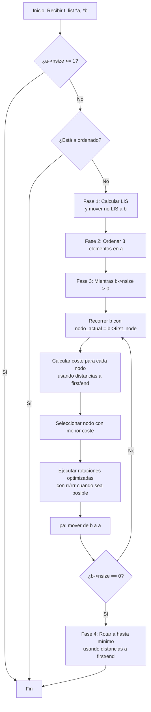
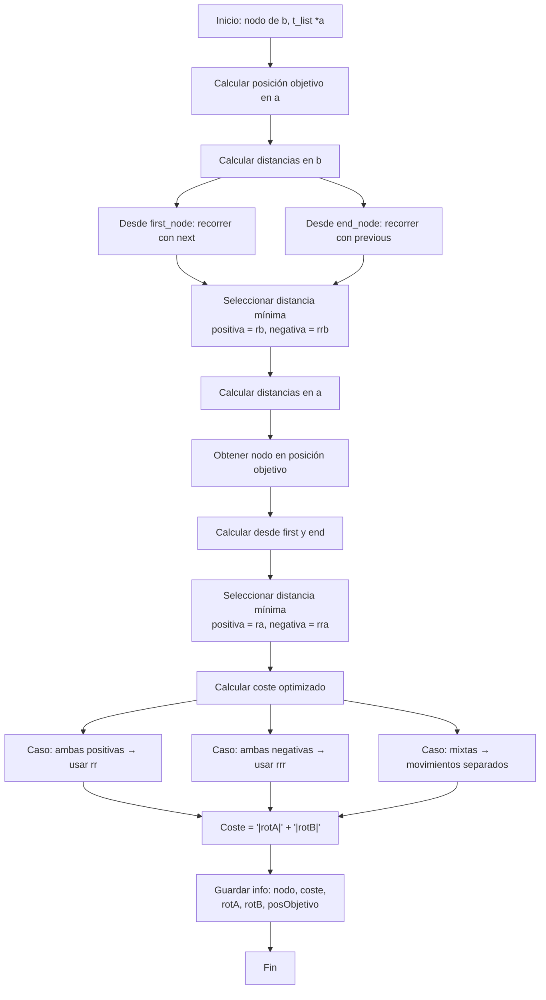

*Este proyecto ha sido creado como parte del currículo de 42 por rjuarez-*
# 📜 Push_Swap

## 📖 Descripción

### Objetivo:

### Decisiones de diseño

He encapsulado cada parte dividiendo en carpetas cada modulo, agrupando las funciones pequeñas y especializadas en ficheros. En todo momento se usan nombres descriptivos tanto de los modulos, archivos y funciones para facilitar el manejo, mantenimiento, testaje y legibilidad.

#### Estructura de datos
*   Al trabajar con listas doblemente enlazada permite rotaciones circulares en tiempo constante, fundamental para las 11 operaciones del proyecto.
*   Incluir en cada nodo los campos espeficidos de para el calculo de costes, conseguimos que unificar y acceder de manera sencilla a los datos necesarios para la toma de decisiones.
*   Incluimos en la estructura de cada pila el numero de datos que contiene para trabajar con los costes y para saber cuantos numeros nos queda por mover.
*   Al incluir en la estructura data la cantidad de numeros a ordenar, conseguimos
*   Añadir un enlace al nodo destino en A nos ofrece ventajas como inmunidad a las rotaciones intermedias, acceso directo sin necesidad de busquedas, precisión al eliminar abmiguedades y consistencia al ser el mismo objeto durante todo el proceso.
*   Trabajando con un diseño modular y semántico facilita la auto explicacion de las operaciones, el encapsulamiento de cada stack indendientemente de sus nodos y facil de mantener la estructura.
*   Al optimizar la estructura de datos, minimizamos la memoria usada y los ciclos de procesador necesarios.
##### Data o datos
```code
typedef struct s_data
{
	struct t_stack	*A;
	struct t_stack	*B
	int				n_nodes;             
}	t_data;
```

##### Stack o pila
```code
typedef struct s_stack
{
	struct t_node	*first_node;
	struct t_node	*end_node;
	int				n_size;
}		t_stack;
```

##### Node o nodo
```code
typedef struct s_node
{
	// Datos de
	int				num;
	int				index;
	// Estructura de la lista
	struct t_node	*next;
	struct t_node	*previous;
	// Para calculo de costes
	int				cost_rot_a;
	int				cost_rot_b;
	int				cost_total;
    // Nodo donde se debe insertar
	struct s_node	*target;
}		t_node;
```
#### Movimientos
En todos los casos, despues de hacer el movimiento, se registra el mismo imprimiendo el nombre del movimiento.

##### Swap o intercambio
_*sa:*_ <br>
Intercambia los dos primeros elementos de la parte superior de la pila a.
No haces nada si solo hay un elemento o no hay ninguno.<br>
_*sb*_ <br>
Intercambia los dos primeros elementos de la parte superior de la pila b.
No haces nada si solo hay un elemento o no hay ninguno.<br>
_*ss:*_<br> sa y sb simultáneamente.

##### Push o empujar
-*pa:*_<br>Toma el primer elemento de la parte superior de b y colócalo en
la parte superior de a. No haces nada si b está vacío. <br>
_*pb:*_<br>Toma el primer elemento en la parte superior de a y colócalo en
la parte superior de b. No hacer nada si a está vacío. <br>

##### Rotate o rotacion
_*ra:*_<br>Desplaza todos los elementos de la pila a en 1 posición.
El primer elemento se convierte en el último.<br>
_*rb:*_<br>Desplaza todos los elementos de la pila b en 1 posición.
El primer elemento se convierte en el último.<br>
_*rr:*_<br>ra y rb simultáneamente.<br>

##### Reverse rotate o rotacion inversa
_*rra:*_<br> Desplaza todos los elementos de la pila a en 1 posición.
El último elemento se convierte en el primero.<br>
_*rrb:*_<br> Desplaza todos los elementos de la pila b en 1 posición.
El último elemento se convierte en el primero.<br>
_*rrr:*_<br> rra y rrb simultáneamente.<br>


#### Carga de datos en la estructura
El parser acepta tanto argumentos separados como strings con múltiples números:

```code
# Formato 1: Argumentos separados
./push_swap 5 2 8 1 9

# Formato 2: String entre comillas
./push_swap "5 2 8 1 9"

# Formato 3: Mixto
./push_swap 5 2 "8 1" 9
```
El subject de 42 requiere soportar ambos formatos. Para lograrlo, el parser:

 -Detecta si un argumento contiene espacios usando
 -Si tiene espacios, lo divide en tokens usando
 -Si no tiene espacios, lo procesa como un número individual

Para ello se usa una validacion a tres niveles:
1-Validación de formato.
2-Validación de rango usando itol y comprobando que el numero resultante esta en rango.
3-Validación de duplicados.

Ante cualquier error, se libera memoria.

#### Algoritmo de Ordenacion
El algoritmo implementa una estrategia de costo mínimo para ordenar la pila, moviendo elementos entre A y B hasta que todo esté ordenado.

##### Preparacion del pilas
1- Reducimos la pila A a 3 nodos.
-   Caso base manejable: 3 elementos tienen solo 5 combinaciones posibles
-   Eficiencia: Es el tamaño máximo que podemos ordenar con un número fijo de operaciones
-   Simplicidad: El algoritmo de 3 elementos es trivial y rápido
2- Ordenar pila A de 3 nodos. 
-   Normalización: Convierte números arbitrarios en 1..n
-   Comparación simplificada: index es más fácil de comparar que valores originales
-   Target finding: Buscar el número justo mayor se vuelve buscar el índice justo mayor
##### Ordenacion
Esta parte se itera hasta que no tengamos nodos en B
1- Indexamos
-   Actualización necesaria: Los índices cambian cuando se mueven nodos
-   Precisión: Los cálculos de costos dependen de posiciones actuales
-   Simplicidad: Recalcular desde cero es más simple que mantener índices incrementalmente
2- Buscar nodo destino.
-   Mantiene orden: Insertar un número después del justo mayor preserva el orden ascendente
-   Wrap around: Si es el número más grande, va al principio (después del mínimo)
-   Eficiencia O(n): Aceptable para el tamaño del problema
3- Calculo de costes.
*   Calculo de costos individuales
-   Dirección clara: + = rotación normal (ra/rb), - = reverse (rra/rrb)
-   Optimización de rotaciones conjuntas: Mismo signo = usar rr/rrr
-   Cálculo simple: La distancia absoluta indica número de movimientos
*   Calculo de costos total
-   Rotaciones conjuntas: Cuando ambos son positivos, podemos usar rr
-   Ahorro significativo: Reduce el número de operaciones hasta en un 50%
-   Lógica clara: Fácil de entender y depurar
4- Ejecucion del movimiento con menor costo
*   Seleccion del movimiento de menor costo
-   Simplicidad: No necesita estructuras complejas
-   Suficiente: n máximo es pequeño (500-1000)
-   Precisión: Encuentra el óptimo global
*   Ejecucion el movimiento elegido
-   Máxima eficiencia: Aprovecha rr y rrr al máximo
-   Orden lógico: Conjuntas → individuales
-   Ahorro comprobado: Reduce el número total de operaciones
##### Organización final de pila A
1- Indexacion de A. necesario ya que al pasar la pila A el ultimo nodo de B, hay que reindexar.
2- Rotar hasta ordenar.
-   Formato requerido: El subject pide que al final el menor esté arriba
-   Mínimo de movimientos: Siempre rotar por el lado más corto
-   Simplicidad: La pila ya está ordenada, solo falta rotar
Al trabajar con el mitad superior o inferior del la pila conseguimos:
-   Eficiencia: Elige el camino más corto (ra o rra)
-   Complejidad O(n): Solo recorre la pila una vez para encontrar la posición
-   Precisión: Garantiza el mínimo de rotaciones

### Implementacion

📁 push swap<br>
	├── push_swap.h<br>
	├── push_swap.c<br>
	├── Makefile<br>
	├── README.md<br>
	└── 📁src<br>
		├── 📁[algorithm](#Módulo-algorithm)<br>
		│   ├── algorithm.h<br>
		│   ├── first_step.c<br>
		│   ├── target.c<br>
		│   ├── cost.c<br>
		│   ├── execute_best_move.c<br>
		│   └── algorithm.c<br>
		├── 📁[data](https://github.com/Rjrtriky/Push_Swap/edit/main/README.md#-m%C3%B3dulo-data)<br>
		│   ├── data.h<br>
		│   ├── node.c<br>
		│   ├── stack.c<br>
		│   ├── stack_utils.c<br>
		│   └── data.c<br>
		├── 📁[ft_printf](#módulo-ft_printf)<br>
		│   ├── ft_printf.h<br>
		│   ├── ft_printf.c<br>
		│   ├── ft_conver.c<br>
		│   ├── ft_conver_numbers.c<br>
		│   └── ft_puts.c<br>
		├── 📁[libft](#módulo-libft)<br>
		│   ├── libft.h<br>
		│   ├── ft_abs.c<br>
		│   ├── ft_atol.c<br>
		│   └── ft_recalloc.c<br>
		├── 📁[moves](#módulo-moves)<br>
		│   ├── moves.h<br>
		│   ├── moves_utils.c<br>
		│   ├── push.c<br>
		│   ├── swap.c<br>
		│   ├── rotate.c<br>
		│   └── reverse_rotate.c<br>
		└── 📁[parser](#módulo-parser)<br>
			├── parser.h<br>
			├── parser.c<br>
			├── split_args.c<br>
			└── validate.c<br>

### 📦 Módulo Data

#### data.c

##### FT_DATA_NEW - `t_data *ft_data_new(void)`
**Definición:** Crea e inicializa una nueva estructura t_data con stacks A y B vacíos

**Parámetros:** Ninguno

**Retorno:** {t_data*}
- **Correcto:** Puntero a la nueva estructura t_data inicializada
- **Incorrecto:** NULL si falla la asignación de memoria

**Comportamiento:**
1. Asigna memoria para t_data
2. Crea stack_a con ft_stack_new()
3. Crea stack_b con ft_stack_new()
4. Inicializa n_nodes a 0

##### FT_DATA_FREE - `int ft_data_free(t_data *data)`
**Definición:** Libera toda la memoria asociada a la estructura t_data y sus stacks

**Parámetros:**
- `{t_data*} data` - Puntero a la estructura a liberar

**Retorno:** {int}
- **Correcto:** TRUE (1) si se liberó correctamente
- **Incorrecto:** FALSE (0) si data es NULL

**Comportamiento:**
1. Verifica que data no sea NULL
2. Libera stack_a con ft_stack_free()
3. Libera stack_b con ft_stack_free()
4. Establece n_nodes a 0
5. Libera data

##### FT_DATA_INDEX - `void ft_data_index(t_data *data)`
**Definición:** Asigna índices ordinales a todos los nodos de stack A y stack B

**Parámetros:**
- `{t_data*} data` - Estructura que contiene los stacks

**Retorno:** void

**Comportamiento:**
1. Indexa stack A con ft_stack_index_ord()
2. Si stack B existe y no está vacío, asigna índices secuenciales (1,2,3...)

##### FT_DATA_STACK_A_ADD - `int ft_data_stack_a_add(t_data *data, int nbr)`
**Definición:** Crea un nuevo nodo con el número dado y lo añade al final del stack A

**Parámetros:**
- `{t_data*} data` - Estructura que contiene stack A
- `{int} nbr` - Número a almacenar en el nodo

**Retorno:** {int}
- **Correcto:** TRUE (1) si se creó y añadió correctamente
- **Incorrecto:** FALSE (0) si data es NULL, falla la creación del stack, falla la creación del nodo, o falla la operación de añadir

**Comportamiento:**
1. Verifica data no sea NULL
2. Si stack A no existe, lo crea
3. Crea nuevo nodo con ft_node_new()
4. Añade nodo al final del stack con ft_stack_add_last()
5. Incrementa n_nodes

##### FT_DATA_STACK_B_ADD - `int ft_data_stack_b_add(t_data *data, int nbr)`
**Definición:** Crea un nuevo nodo con el número dado y lo añade al principio del stack B

**Parámetros:**
- `{t_data*} data` - Estructura que contiene stack B
- `{int} nbr` - Número a almacenar en el nodo

**Retorno:** {int}
- **Correcto:** TRUE (1) si se creó y añadió correctamente
- **Incorrecto:** FALSE (0) si data es NULL, falla la creación del stack, falla la creación del nodo, o falla la operación de añadir

**Comportamiento:**
1. Verifica data no sea NULL
2. Si stack B no existe, lo crea
3. Crea nuevo nodo con ft_node_new()
4. Añade nodo al principio del stack con ft_stack_add()
5. Incrementa n_nodes

#### stack.c

##### FT_STACK_NEW - `t_stack *ft_stack_new(void)`
**Definición:** Crea e inicializa una nueva estructura t_stack vacía

**Parámetros:** Ninguno

**Retorno:** {t_stack*}
- **Correcto:** Puntero a la nueva estructura t_stack
- **Incorrecto:** NULL si falla la asignación de memoria

**Comportamiento:**
1. Asigna memoria para t_stack
2. Inicializa first_node a NULL
3. Inicializa end_node a NULL
4. Inicializa size a 0

##### FT_STACK_FREE - `int ft_stack_free(t_stack *stack)`
**Definición:** Libera la memoria del stack y de todos sus nodos

**Parámetros:**
- `{t_stack*} stack` - Puntero al stack a liberar

**Retorno:** {int}
- **Correcto:** TRUE (1) si se liberó correctamente
- **Incorrecto:** FALSE (0) si stack es NULL

**Comportamiento:**
1. Extrae y elimina todos los nodos del stack con ft_stack_pop()
2. Libera cada nodo con ft_node_free()
3. Libera la estructura del stack

##### FT_STACK_INDEX_ORD - `void ft_stack_index_ord(t_stack *stack)`
**Definición:** Asigna índices ordinales (1..n) a los nodos del stack basados en sus valores numéricos

**Parámetros:**
- `{t_stack*} stack` - Stack a indexar

**Retorno:** void

**Comportamiento:**
1. Limpia los índices existentes con ft_stack_index_clear()
2. Itera desde i=1 hasta size del stack
3. En cada iteración, encuentra el nodo con el valor mínimo no indexado
4. Asigna el índice i a ese nodo

**Ejemplo:** [42, 7, 99, 23, 5] → [4, 2, 5, 3, 1]

##### FT_STACK_ADD - `int ft_stack_add(t_stack *stack, t_node *node)`
**Definición:** Añade un nodo al principio del stack

**Parámetros:**
- `{t_stack*} stack` - Stack donde añadir el nodo
- `{t_node*} node` - Nodo a añadir

**Retorno:** {int}
- **Correcto:** TRUE (1) si se añadió correctamente
- **Incorrecto:** FALSE (0) si stack o node es NULL

**Comportamiento:**
1. Verifica parámetros
2. Si el stack está vacío, el nodo es first y end
3. Si no, el nuevo nodo apunta al antiguo first_node
4. Actualiza first_node al nuevo nodo
5. Incrementa size

##### FT_STACK_POP - `t_node *ft_stack_pop(t_stack *stack)`
**Definición:** Extrae y retorna el primer nodo del stack

**Parámetros:**
- `{t_stack*} stack` - Stack del que extraer el nodo

**Retorno:** {t_node*}
- **Correcto:** Puntero al nodo extraído
- **Incorrecto:** NULL si stack es NULL o está vacío

**Comportamiento:**
1. Verifica que el stack no esté vacío
2. Guarda referencia al first_node
3. Actualiza first_node al siguiente nodo
4. Si el stack queda vacío, end_node también es NULL
5. Decrementa size
6. Desconecta el nodo extraído (next y previous a NULL)

#### stack_utils.c

##### FT_STACK_ADD_LAST - `int ft_stack_add_last(t_stack *stack, t_node *node)`
**Definición:** Añade un nodo al final del stack

**Parámetros:**
- `{t_stack*} stack` - Stack donde añadir el nodo
- `{t_node*} node` - Nodo a añadir

**Retorno:** {int}
- **Correcto:** TRUE (1) si se añadió correctamente
- **Incorrecto:** FALSE (0) si stack o node es NULL

**Comportamiento:**
1. Verifica parámetros
2. Si el stack está vacío, el nodo es first y end
3. Si no, el antiguo end_node apunta al nuevo nodo
4. Actualiza end_node al nuevo nodo
5. Incrementa size

##### FT_STACK_POP_LAST - `t_node *ft_stack_pop_last(t_stack *stack)`
**Definición:** Extrae y retorna el último nodo del stack

**Parámetros:**
- `{t_stack*} stack` - Stack del que extraer el nodo

**Retorno:** {t_node*}
- **Correcto:** Puntero al nodo extraído
- **Incorrecto:** NULL si stack es NULL o está vacío

**Comportamiento:**
1. Verifica que el stack no esté vacío
2. Guarda referencia al end_node
3. Actualiza end_node al nodo anterior
4. Si el stack queda vacío, first_node también es NULL
5. Decrementa size
6. Desconecta el nodo extraído

##### FT_STACK_INDEX_CLEAR - `void ft_stack_index_clear(t_stack *stack)`
**Definición:** Establece el índice de todos los nodos del stack a 0

**Parámetros:**
- `{t_stack*} stack` - Stack cuyos índices limpiar

**Retorno:** void

**Comportamiento:**
1. Recorre todos los nodos del stack
2. Asigna index = 0 a cada uno

##### FT_IS_SORT_STACK - `int ft_is_sort_stack(t_stack *stack)`
**Definición:** Verifica si el stack está ordenado circularmente según los índices

**Parámetros:**
- `{t_stack*} stack` - Stack a verificar

**Retorno:** {int}
- **Correcto:** TRUE (1) si está ordenado circularmente
- **Incorrecto:** FALSE (0) si no está ordenado

**Comportamiento:**
1. Encuentra el nodo con índice 1
2. Verifica que los índices sigan el orden circular ascendente

#### node.c

#### FT_NODE_NEW - `t_node *ft_node_new(int nbr)`
**Definición:** Crea e inicializa un nuevo nodo con el número dado

**Parámetros:**
- `{int} nbr` - Número a almacenar en el nodo

**Retorno:** {t_node*}
- **Correcto:** Puntero al nuevo nodo inicializado
- **Incorrecto:** NULL si falla la asignación de memoria

**Comportamiento:**
1. Asigna memoria para t_node
2. Inicializa num con nbr
3. Inicializa next a NULL
4. Inicializa previous a NULL
5. Inicializa index a 0
6. Inicializa target a NULL
7. Inicializa cost_rot_a, cost_rot_b, cost_total a 0

##### FT_NODE_FREE - `int ft_node_free(t_node *node)`
**Definición:** Libera la memoria de un nodo

**Parámetros:**
- `{t_node*} node` - Nodo a liberar

**Retorno:** {int}
- **Correcto:** TRUE (1) si se liberó correctamente
- **Incorrecto:** FALSE (0) si node es NULL

**Comportamiento:**
1. Verifica que node no sea NULL
2. Libera la memoria del nodo

### 📦 Módulo Algorithm

#### algorithm.c

##### FT_COST_BASED_ALGORITHM - `void ft_cost_based_algorithm(t_data *data)`
**Definición:** Algoritmo principal de ordenación basado en cálculo de costes

**Parámetros:**
- `{t_data*} data` - Estructura que contiene los stacks

**Retorno:** void

**Comportamiento:**
1. Prepara stack A dejando solo 3 elementos
2. Ordena esos 3 elementos
3. Mientras stack B no esté vacío:
   - Re-indexa los stacks
   - Asigna targets a los nodos de B
   - Calcula costes de mover cada nodo
   - Ejecuta el movimiento de menor coste
4. Ordena final rotando hasta que el índice 1 quede arriba

##### FT_ROTATE_SORT - `void ft_rotate_sort(t_data *data)`
**Definición:** Rota el stack A para dejar el elemento con índice 1 en la cima

**Parámetros:**
- `{t_data*} data` - Estructura que contiene stack A

**Retorno:** void

**Comportamiento:**
1. Encuentra la posición del nodo con índice 1
2. Si está en la mitad superior, usa rra
3. Si está en la mitad inferior, usa ra
4. Rota hasta que el índice 1 sea el first_node

#### first_step.c

##### FT_STACK_A_ONLY_3 - `void ft_stack_a_only_3(t_data *data)`
**Definición:** Reduce el stack A a solo 3 elementos moviendo el resto a B

**Parámetros:**
- `{t_data*} data` - Estructura que contiene los stacks

**Retorno:** void

**Comportamiento:**
1. Mientras stack A tenga más de 3 elementos, hace pb
2. Si quedan exactamente 3, llama a ft_sort_3()
3. Indexa el stack A resultante

##### FT_SORT_3 - `void ft_sort_3(t_data *data)`
**Definición:** Ordena un stack de exactamente 3 elementos

**Parámetros:**
- `{t_data*} data` - Estructura que contiene stack A

**Retorno:** void

**Comportamiento:** Maneja las 5 permutaciones posibles:
| Permutación | Operaciones |
|-------------|-------------|
| 2,1,3 | sa |
| 3,2,1 | sa + rra |
| 3,1,2 | ra |
| 2,3,1 | sa + ra |
| 1,3,2 | rra |

#### target.c

##### FT_FIND_NODE_TARGET - `void ft_find_node_target(t_stack *stack_a, t_node *node_b)`
**Definición:** Encuentra el nodo destino en stack A para un nodo de stack B

**Parámetros:**
- `{t_stack*} stack_a` - Stack A donde buscar el target
- `{t_node*} node_b` - Nodo de stack B que necesita target

**Retorno:** void (establece node_b->target)

**Comportamiento:**
1. Busca el nodo en A con el valor justo mayor a node_b->num
2. Si no existe (node_b es el más grande), toma el nodo con valor mínimo
3. Asigna ese nodo como target de node_b

**Ejemplo:**
Stack A: [1, 3, 5, 7, 9]
node_b->num = 6 → target = 7
node_b->num = 10 → target = 1 (wrap around)

##### FT_ASSIGN_TARGETS_STACK_B - `void ft_assign_targets_stack_b(t_data *data)`
**Definición:** Asigna targets a todos los nodos de stack B

**Parámetros:**
- `{t_data*} data` - Estructura que contiene los stacks

**Retorno:** void

**Comportamiento:**
1. Recorre todos los nodos de stack B
2. Para cada uno, llama a ft_find_node_target()

#### cost.c

##### FT_GET_NODE_POSITION_IN_STACK - `int ft_get_node_position_in_stack(t_stack *stack, t_node *node_search)`
**Definición:** Obtiene la posición (índice) de un nodo dentro del stack

**Parámetros:**
- `{t_stack*} stack` - Stack donde buscar
- `{t_node*} node_search` - Nodo a localizar

**Retorno:** {int}
- **Correcto:** Posición del nodo (0 = first_node)
- **Incorrecto:** -1 si no se encuentra el nodo

**Comportamiento:**
1. Recorre el stack contando posiciones
2. Cuando encuentra el nodo, retorna la posición

##### FT_CALCULATE_COST_B - `void ft_calculate_cost_b(t_stack *stack_b, t_node *node_b)`
**Definición:** Calcula el coste de rotación para traer un nodo de B al tope

**Parámetros:**
- `{t_stack*} stack_b` - Stack B que contiene el nodo
- `{t_node*} node_b` - Nodo a evaluar

**Retorno:** void (establece node_b->cost_rot_b)

**Comportamiento:**
1. Obtiene la posición del nodo en stack B
2. Si posición ≤ size/2: coste = posición (usar rb)
3. Si posición > size/2: coste = -(size - posición) (usar rrb)

**Ejemplo:**
Stack B size 5, nodo en posición 4:
4 > 2.5 → cost_rot_b = -(5-4) = -1 (1 rrb)

##### FT_CALCULATE_COST_A - `void ft_calculate_cost_a(t_stack *stack_a, t_node *node_b)`
**Definición:** Calcula el coste de rotación para traer el target de A al tope

**Parámetros:**
- `{t_stack*} stack_a` - Stack A que contiene el target
- `{t_node*} node_b` - Nodo de B cuyo target evaluamos

**Retorno:** void (establece node_b->cost_rot_a)

**Comportamiento:**
1. Obtiene la posición del target en stack A
2. Si posición ≤ size/2: coste = posición (usar ra)
3. Si posición > size/2: coste = -(size - posición) (usar rra)

##### FT_CALCULATE_COSTS - `void ft_calculate_costs(t_data *data)`
**Definición:** Calcula el coste total de mover cada nodo de B a A

**Parámetros:**
- `{t_data*} data` - Estructura que contiene los stacks

**Retorno:** void

**Comportamiento:**
1. Para cada nodo de B, calcula cost_rot_a y cost_rot_b
2. Calcula coste total según la fórmula:
   - Si misma dirección: max(abs(cost_a), abs(cost_b))
   - Si direcciones opuestas: abs(cost_a) + abs(cost_b)

**Fórmula de optimización:**
| Situación | Fórmula | Ejemplo |
|-----------|---------|---------|
| Misma dirección | `max(abs(a), abs(b))` | a=2, b=3 → 3 movimientos |
| Direcciones opuestas | `abs(a) + abs(b)` | a=2, b=-3 → 5 movimientos |

#### execute_best_move.c

#### FT_FIND_BEST_NODE - `t_node *ft_find_best_node(t_stack *stack_b)`
**Definición:** Encuentra el nodo de B con el menor coste total

**Parámetros:**
- `{t_stack*} stack_b` - Stack B donde buscar

**Retorno:** {t_node*}
- **Correcto:** Puntero al nodo con menor coste total
- **Incorrecto:** NULL si stack_b está vacío

**Comportamiento:**
1. Recorre todos los nodos de B
2. Compara cost_total de cada uno
3. Retorna el que tiene el valor más bajo

##### FT_ROTATE_STACK_A - `void ft_rotate_stack_a(t_data *data, int *cost_a)`
**Definición:** Ejecuta las rotaciones necesarias en stack A según el coste

**Parámetros:**
- `{t_data*} data` - Estructura que contiene stack A
- `{int*} cost_a` - Puntero al coste de rotación (se modifica durante la ejecución)

**Retorno:** void

**Comportamiento:**
1. Mientras cost_a > 0: ejecuta ra() y decrementa cost_a
2. Mientras cost_a < 0: ejecuta rra() y incrementa cost_a

##### FT_ROTATE_STACK_B - `void ft_rotate_stack_b(t_data *data, int *cost_b)`
**Definición:** Ejecuta las rotaciones necesarias en stack B según el coste

**Parámetros:**
- `{t_data*} data` - Estructura que contiene stack B
- `{int*} cost_b` - Puntero al coste de rotación (se modifica durante la ejecución)

**Retorno:** void

**Comportamiento:**
1. Mientras cost_b > 0: ejecuta rb() y decrementa cost_b
2. Mientras cost_b < 0: ejecuta rrb() y incrementa cost_b

##### FT_ROTATE_STACKS_FOR_NODE - `void ft_rotate_stacks_for_node(t_data *data, t_node *best_node)`
**Definición:** Ejecuta rotaciones conjuntas y luego individuales para un nodo

**Parámetros:**
- `{t_data*} data` - Estructura que contiene los stacks
- `{t_node*} best_node` - Nodo óptimo a mover

**Retorno:** void

**Comportamiento:**
1. Mientras ambos costes sean positivos: ejecuta rr()
2. Mientras ambos costes sean negativos: ejecuta rrr()
3. Ejecuta rotaciones individuales restantes en A y B

**Optimización:**
Sin optimización: ra, ra, ra, rb, rb (5 operaciones)
Con optimización: rr, rr, ra (3 operaciones)

##### FT_EXECUTE_BEST_MOVE - `void ft_execute_best_move(t_data *data)`
**Definición:** Encuentra y ejecuta el movimiento de menor coste

**Parámetros:**
- `{t_data*} data` - Estructura que contiene los stacks

**Retorno:** void

**Comportamiento:**
1. Encuentra el mejor nodo con ft_find_best_node()
2. Rota ambos stacks para dejar el nodo y su target en la cima
3. Ejecuta pa() para mover el nodo de B a A

### 📦 Módulo Moves

#### swap.c

##### FT_SWAP - `void ft_swap(t_stack *stack)`
**Definición:** Intercambia los dos primeros elementos del stack

**Parámetros:**
- `{t_stack*} stack` - Stack donde realizar el intercambio

**Retorno:** void

**Comportamiento:**
1. Verifica que el stack tenga al menos 2 elementos
2. Extrae los dos primeros nodos con ft_stack_pop()
3. Los vuelve a añadir en orden inverso

##### SA - `void sa(t_data *data)`
**Definición:** Intercambia los dos primeros elementos de stack A

**Parámetros:**
- `{t_data*} data` - Estructura que contiene stack A

**Retorno:** void

**Comportamiento:**
1. Verifica que stack A tenga al menos 2 elementos
2. Ejecuta ft_swap() en stack A
3. Registra el movimiento "sa"

##### SB - `void sb(t_data *data)`
**Definición:** Intercambia los dos primeros elementos de stack B

**Parámetros:**
- `{t_data*} data` - Estructura que contiene stack B

**Retorno:** void

**Comportamiento:**
1. Verifica que stack B tenga al menos 2 elementos
2. Ejecuta ft_swap() en stack B
3. Registra el movimiento "sb"

##### SS - `void ss(t_data *data)`
**Definición:** Ejecuta sa y sb simultáneamente

**Parámetros:**
- `{t_data*} data` - Estructura que contiene los stacks

**Retorno:** void

**Comportamiento:**
1. Verifica que ambos stacks tengan al menos 2 elementos
2. Ejecuta ft_swap() en stack A
3. Ejecuta ft_swap() en stack B
4. Registra el movimiento "ss"

#### push.c

##### FT_PUSH - `void ft_push(t_stack *stack_ori, t_stack *stack_des)`
**Definición:** Extrae un nodo del stack origen y lo añade al destino

**Parámetros:**
- `{t_stack*} stack_ori` - Stack origen (del que se extrae)
- `{t_stack*} stack_des` - Stack destino (donde se añade)

**Retorno:** void

**Comportamiento:**
1. Extrae el primer nodo de stack_ori con ft_stack_pop()
2. Si el nodo existe, lo añade al principio de stack_des con ft_stack_add()

###### PA - `void pa(t_data *data)`
**Definición:** Mueve el primer elemento de stack B a stack A

**Parámetros:**
- `{t_data*} data` - Estructura que contiene los stacks

**Retorno:** void

**Comportamiento:**
1. Verifica que stack B no esté vacío
2. Si stack A no existe, lo crea
3. Ejecuta ft_push() de B a A
4. Registra el movimiento "pa"

##### PB - `void pb(t_data *data)`
**Definición:** Mueve el primer elemento de stack A a stack B

**Parámetros:**
- `{t_data*} data` - Estructura que contiene los stacks

**Retorno:** void

**Comportamiento:**
1. Verifica que stack A no esté vacío
2. Si stack B no existe, lo crea
3. Ejecuta ft_push() de A a B
4. Registra el movimiento "pb"

#### rotate.c

#### FT_ROTATE - `void ft_rotate(t_stack *stack)`
**Definición:** Rota el stack hacia arriba (el primer elemento va al final)

**Parámetros:**
- `{t_stack*} stack` - Stack a rotar

**Retorno:** void

**Comportamiento:**
1. Extrae el primer nodo con ft_stack_pop()
2. Si el nodo existe, lo añade al final con ft_stack_add_last()

##### RA - `void ra(t_data *data)`
**Definición:** Rota stack A hacia arriba

**Parámetros:**
- `{t_data*} data` - Estructura que contiene stack A

**Retorno:** void

**Comportamiento:**
1. Verifica que stack A tenga al menos 2 elementos
2. Ejecuta ft_rotate() en stack A
3. Registra el movimiento "ra"

##### RB - `void rb(t_data *data)`
**Definición:** Rota stack B hacia arriba

**Parámetros:**
- `{t_data*} data` - Estructura que contiene stack B

**Retorno:** void

**Comportamiento:**
1. Verifica que stack B tenga al menos 2 elementos
2. Ejecuta ft_rotate() en stack B
3. Registra el movimiento "rb"

##### RR - `void rr(t_data *data)`
**Definición:** Ejecuta ra y rb simultáneamente

**Parámetros:**
- `{t_data*} data` - Estructura que contiene los stacks

**Retorno:** void

**Comportamiento:**
1. Verifica que ambos stacks tengan al menos 2 elementos
2. Ejecuta ft_rotate() en stack A
3. Ejecuta ft_rotate() en stack B
4. Registra el movimiento "rr"

#### reverse_rotate.c

##### FT_REVERSE_ROTATE - `void ft_reverse_rotate(t_stack *stack)`
**Definición:** Rota el stack hacia abajo (el último elemento va al principio)

**Parámetros:**
- `{t_stack*} stack` - Stack a rotar inversamente

**Retorno:** void

**Comportamiento:**
1. Extrae el último nodo con ft_stack_pop_last()
2. Si el nodo existe, lo añade al principio con ft_stack_add()

##### RRA - `void rra(t_data *data)`
**Definición:** Rota stack A hacia abajo

**Parámetros:**
- `{t_data*} data` - Estructura que contiene stack A

**Retorno:** void

**Comportamiento:**
1. Verifica que stack A tenga al menos 2 elementos
2. Ejecuta ft_reverse_rotate() en stack A
3. Registra el movimiento "rra"

##### RRB - `void rrb(t_data *data)`
**Definición:** Rota stack B hacia abajo

**Parámetros:**
- `{t_data*} data` - Estructura que contiene stack B

**Retorno:** void

**Comportamiento:**
1. Verifica que stack B tenga al menos 2 elementos
2. Ejecuta ft_reverse_rotate() en stack B
3. Registra el movimiento "rrb"

##### RRR - `void rrr(t_data *data)`
**Definición:** Ejecuta rra y rrb simultáneamente

**Parámetros:**
- `{t_data*} data` - Estructura que contiene los stacks

**Retorno:** void

**Comportamiento:**
1. Verifica que ambos stacks tengan al menos 2 elementos
2. Ejecuta ft_reverse_rotate() en stack A
3. Ejecuta ft_reverse_rotate() en stack B
4. Registra el movimiento "rrr"

#### moves_utils.c

##### FT_REGISTER - `void ft_register(char *mov)`
**Definición:** Registra (imprime) un movimiento realizado

**Parámetros:**
- `{char*} mov` - String con el nombre del movimiento

**Retorno:** void

**Comportamiento:**
1. Imprime el movimiento usando ft_printf()
2. Añade un salto de línea al final

### 📦 Módulo Parser

#### parser.c

##### FT_PARSE_AND_LOAD - `t_data *ft_parse_and_load(int argc, char **argv)`
**Definición:** Procesa los argumentos de línea de comandos y carga los números en data

**Parámetros:**
- `{int} argc` - Número de argumentos
- `{char**} argv` - Array de argumentos

**Retorno:** {t_data*}
- **Correcto:** Puntero a t_data con los números cargados
- **Incorrecto:** NULL si hay error o falla memoria

**Comportamiento:**
1. Crea una nueva estructura t_data
2. Itera sobre los argumentos (desde argv[1])
3. Para cada argumento, llama a ft_process_argument()
4. Si hay error, libera todo y retorna NULL

##### FT_PROCESS_ARGUMENT - `static int ft_process_argument(t_data *data, char *arg)`
**Definición:** Procesa un argumento individual (puede contener múltiples números)

**Parámetros:**
- `{t_data*} data` - Estructura donde cargar los datos
- `{char*} arg` - Argumento a procesar

**Retorno:** {int}
- **Correcto:** FALSE (0) si se procesó correctamente
- **Incorrecto:** TRUE (1) si hay error

**Comportamiento:**
1. Si el argumento contiene espacios, lo divide en tokens
2. Procesa cada token con ft_process_tokens()
3. Si no contiene espacios, lo valida como número individual

##### FT_PROCESS_TOKENS - `static int ft_process_tokens(t_data *data, char **tokens)`
**Definición:** Procesa un array de tokens (números en string)

**Parámetros:**
- `{t_data*} data` - Estructura donde cargar los datos
- `{char**} tokens` - Array de strings con números

**Retorno:** {int}
- **Correcto:** FALSE (0) si se procesó correctamente
- **Incorrecto:** TRUE (1) si hay error

**Comportamiento:**
1. Itera sobre cada token
2. Valida y convierte cada token a número
3. Añade el número a stack A

#### split_args.c

##### FT_SPLIT_ARGS - `char **ft_split_args(char *str)`
**Definición:** Divide un string con números separados por espacios en un array de tokens

**Parámetros:**
- `{char*} str` - String a dividir

**Retorno:** {char**}
- **Correcto:** Array NULL-terminated de tokens
- **Incorrecto:** NULL si falla memoria

**Comportamiento:**
1. Cuenta el número de tokens en el string
2. Asigna memoria para el array de tokens
3. Copia cada token individualmente
4. Termina el array con NULL

##### FT_COUNT_TOKENS - `static int ft_count_tokens(char *str)`
**Definición:** Cuenta cuántos tokens (números) hay en un string

**Parámetros:**
- `{char*} str` - String a analizar

**Retorno:** {int} - Número de tokens encontrados

**Comportamiento:**
1. Itera sobre el string
2. Ignora espacios
3. Cada secuencia de no-espacios cuenta como un token

##### FT_COPY_TOKEN - `static char *ft_copy_token(char *str, int *i)`
**Definición:** Copia un token desde una posición del string

**Parámetros:**
- `{char*} str` - String fuente
- `{int*} i` - Puntero a la posición actual (se actualiza)

**Retorno:** {char*}
- **Correcto:** String con el token copiado
- **Incorrecto:** NULL si falla memoria

**Comportamiento:**
1. Avanza hasta encontrar el inicio del token
2. Calcula la longitud del token
3. Copia el token a nueva memoria

##### FT_FREE_SPLIT - `void ft_free_split(char **tokens)`
**Definición:** Libera la memoria de un array de tokens creado con ft_split_args

**Parámetros:**
- `{char**} tokens` - Array de tokens a liberar

**Retorno:** void

**Comportamiento:**
1. Itera sobre el array liberando cada token
2. Libera el array principal

#### validate.c

##### FT_IS_VALID_TOKEN - `int ft_is_valid_token(char *str)`
**Definición:** Verifica si un token es un número válido

**Parámetros:**
- `{char*} str` - Token a validar

**Retorno:** {int}
- **Correcto:** TRUE (1) si el token es válido
- **Incorrecto:** FALSE (0) si es inválido

**Validaciones:**
- No puede estar vacío
- Puede tener un signo (+ o -) al inicio
- Después del signo, solo dígitos
- No puede tener
**Ejemplos válidos:** "42", "+42", "-5"
**Ejemplos inválidos:** "", "+", "-", "42a", "  5"

##### FT_IS_DUPLICATE - `int ft_is_duplicate(t_stack *stack, int value)`
**Definición:** Verifica si un valor ya existe en el stack

**Parámetros:**
- `{t_stack*} stack` - Stack donde buscar
- `{int} value` - Valor a buscar

**Retorno:** {int}
- **Correcto:** TRUE (1) si el valor es duplicado
- **Incorrecto:** FALSE (0) si no existe

**Comportamiento:**
1. Recorre todos los nodos del stack
2. Compara node->num con value
3. Si encuentra coincidencia, retorna TRUE

##### FT_VALIDATE_INPUT_NUMBER - `int ft_validate_input_number(t_data *data, char *str, int *num)`
**Definición:** Valida un número y lo almacena si es correcto

**Parámetros:**
- `{t_data*} data` - Estructura que contiene stack A para verificar duplicados
- `{char*} str` - String con el número a validar
- `{int*} num` - Puntero donde almacenar el número validado

**Retorno:** {int}
- **Correcto:** FALSE (0) si la validación es exitosa
- **Incorrecto:** TRUE (1) si hay error

**Validaciones realizadas:**
1. Formato válido (ft_is_valid_token)
2. Rango dentro de INT_MIN e INT_MAX (usando ft_atol)
3. No duplicado en stack A

### 📦 Módulo Libft
Solo incluyo las funciones que ya nuevas respecto al proyecto libft original, aunque ft_recalloc no se use en este.

#### ft_abs.c

##### FT_ABS - `int ft_abs(int num)`
**Definición:** Retorna el valor absoluto de un número entero

**Parámetros:**
- `{int} num` - Número a convertir

**Retorno:** {int} - Valor absoluto del número

**Comportamiento:**
- Si num ≥ 0, retorna num
- Si num < 0, retorna -num

#### ft_atol.c

##### FT_ATOL - `long ft_atol(const char *str)`
**Definición:** Convierte un string a long integer

**Parámetros:**
- `{const char*} str` - String a convertir

**Retorno:** {long} - Valor convertido

**Comportamiento:**
1. Ignora espacios al inicio
2. Procesa signo opcional (+ o -)
3. Convierte dígitos a número
4. Retorna el resultado como long

#### ft_recalloc.c

##### FT_RECALLOC - `void *ft_recalloc(unsigned char *old_ptr, unsigned long int new_size)`
**Definición:** Realiza realloc con inicialización a cero de la memoria nueva

**Parámetros:**
- `{unsigned char*} old_ptr` - Puntero antiguo a redimensionar
- `{unsigned long int} new_size` - Nuevo tamaño en bytes

**Retorno:** {void*}
- **Correcto:** Puntero a la nueva memoria
- **Incorrecto:** NULL si falla la asignación

**Comportamiento:**
1. Asigna nueva memoria con ft_calloc() (inicializada a cero)
2. Copia el contenido antiguo a la nueva memoria
3. Libera la memoria antigua
4. Retorna el nuevo puntero


## ⚙️ Instrucciones

### Compilacion

### Ejecucion:

## 📚 Recursos

### Referencias Clasicas:

### Uso de la IA:

## 🔄 Diagrama de flujo del algoritmo




```plaintext

                     ┌──────────────────────────┐
                     │     find_node_target     │
                     └─────────────┬────────────┘
                                   │
                                   ▼
                     ┌──────────────────────────┐
                     │ actual = A.first         │
                     │ mejor = NULL             │
                     └─────────────┬────────────┘
                                   │
                                   ▼
                     ┌──────────────────────────┐
             ┌──────▶│ ¿actual existe?          │────────┐
             │       └──────────────────────────┘        │ NO
             │                    │ SI                   │
             │                    ▼                      │
             │      ┌──────────────────────────────┐     │
             │      │ ¿actual.num > nodo_B.num?    │     │
             │      └───────────────┬──────────────┘     │
             │                      │ SI                 │
             │                      ▼                    │
             │      ┌─────────────────────────────────┐  │
             │      │ ¿mejor es NULL o actual.num <   │  │
             │      │ mejor.num?                      │  │
             │      └───────────────┬─────────────────┘  │
             │                      │ SI                 │
             │                      ▼                    │
             │      ┌─────────────────────────────────┐  │
             │      │ mejor = actual                  │  │
             │      └─────────────────────────────────┘  │
             │                                           │
             │      ┌─────────────────────────────────┐  │
             └──────│ actual = actual.siguiente       │  │
                    └─────────────────────────────────┘  │
                                   │◀────────────────────┘
                                   ▼
                     ┌──────────────────────────┐
                     │ ¿mejor es NULL?          │
                     └─────────────┬────────────┘
                                   │ SI
                                   ▼
                     ┌──────────────────────────┐
                     │ actual = A.first         │
                     │ mejor = actual           │
                     └─────────────┬────────────┘
                                   │
                                   ▼
                     ┌──────────────────────────┐
             ┌──────▶│ ¿actual existe?          │────────┐
             │       └──────────────────────────┘        │ NO
             │                    │ SI                   │
             │                    ▼                      │
             │      ┌──────────────────────────────┐     │
             │      │ ¿actual.num < mejor.num?     │     │
             │      └───────────────┬──────────────┘     │
             │                      │ SI                 │
             │                      ▼                    │
             │      ┌─────────────────────────────────┐  │
             │      │ mejor = actual                  │  │
             │      └─────────────────────────────────┘  │
             │                                           │
             │      ┌─────────────────────────────────┐  │
             └──────│ actual = actual.siguiente       │  │
                    └─────────────────────────────────┘  │
                                   │◀────────────────────┘
                                   ▼
                     ┌──────────────────────────┐
                     │ nodo_B.target = mejor    │
                     └─────────────┬────────────┘
                                   │
                                   ▼
                     ┌──────────────────────────┐
                     │           FIN            │
                     └──────────────────────────┘


### Estructura de datos

### Movimientos

### Ordenacion

