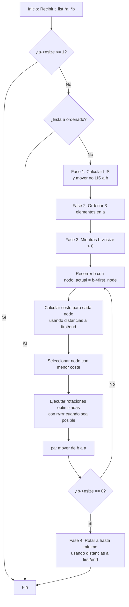
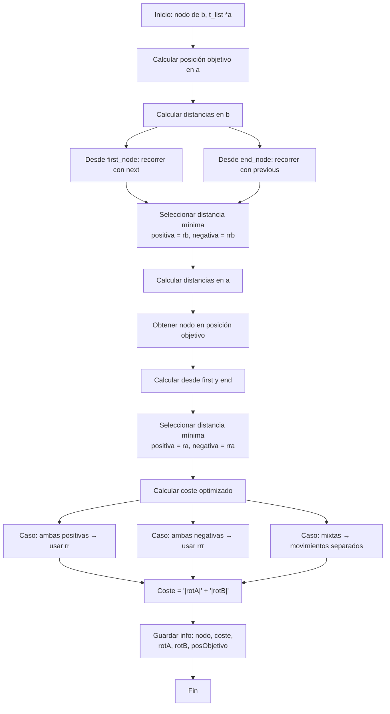

*Este proyecto ha sido creado como parte del currículo de 42 por rjuarez-*
# 📜 get_next_line

## 📖 Descripción

### Objetivo:

### Decisiones de diseño

#### Estructura de datos
*   Al trabajar con listas doblemente enlazada permite rotaciones circulares en tiempo constante, fundamental para las 11 operaciones del proyecto.
*   Incluir en cada nodo los campos espeficidos de para el calculo de costes, conseguimos que unificar y acceder de manera sencilla a los datos necesarios para la toma de decisiones.
*   Incluimos en la estructura de cada pila el numero de datos que contiene para trabajar con los costes y para saber cuantos numeros nos queda por mover.
*   Al incluir en la estructura data la cantidad de numeros a ordenar, conseguimos
*   Añadir un enlace al nodo destino en A nos ofrece ventajas como inmunidad a las rotaciones intermedias, acceso directo sin necesidad de busquedas, precisión al eliminar abmiguedades y consistencia al ser el mismo objeto durante todo el proceso.
*   Trabajando con un diseño modular y semántico facilita la auto explicacion de las operaciones, el encapsulamiento de cada stack indendientemente de sus nodos y facil de mantener la estructura.
*   Al optimizar la estructura de datos, minimizamos la memoria usada y los ciclos de procesador necesarios.
##### Datos
```code
typedef struct s_data
{
	struct t_stack	*A;
	struct t_stack	*B
	int				n_nodes;             
}	t_data;
```

##### Stack o pila
```code
typedef struct s_stack
{
	struct t_node	*first_node;
	struct t_node	*end_node;
	int				n_size;
}		t_stack;
```

##### Node o nodo
```code
typedef struct s_node
{
	// Datos de
	int				num;
	int				index;
	// Estructura de la lista
	struct t_node	*next;
	struct t_node	*previous;
	// Para calculo de costes
	int				cost_rot_a;
	int				cost_rot_b;
	int				cost_total;
    // Nodo donde se debe insertar
	struct s_node	*target;
}		t_node;
```
#### Movimientos

##### Swap o intercambio
_*sa:*_ <br>
Intercambia los dos primeros elementos de la parte superior de la pila a.
No haces nada si solo hay un elemento o no hay ninguno.<br>
_*sb*_ <br>
Intercambia los dos primeros elementos de la parte superior de la pila b.
No haces nada si solo hay un elemento o no hay ninguno.<br>
_*ss:*_<br> sa y sb simultáneamente.

##### Push o empujar
-*pa:*_<br>Toma el primer elemento de la parte superior de b y colócalo en
la parte superior de a. No haces nada si b está vacío. <br>
_*pb:*_<br>Toma el primer elemento en la parte superior de a y colócalo en
la parte superior de b. No hacer nada si a está vacío. <br>

##### Rotate o rotacion
_*ra:*_<br>Desplaza todos los elementos de la pila a en 1 posición.
El primer elemento se convierte en el último.<br>
_*rb:*_<br>Desplaza todos los elementos de la pila b en 1 posición.
El primer elemento se convierte en el último.<br>
_*rr:*_<br>ra y rb simultáneamente.<br>

##### Reverse rotate o rotacion inversa
_*rra:*_<br> Desplaza todos los elementos de la pila a en 1 posición.
El último elemento se convierte en el primero.<br>
_*rrb:*_<br> Desplaza todos los elementos de la pila b en 1 posición.
El último elemento se convierte en el primero.<br>
_*rrr:*_<br> rra y rrb simultáneamente.<br>

#### Ordenacion

#### Pasos a seguir
##### Introducion de datos rellenando stack A

*   Si hay parametros al llamar al programa se van creando y metiendo en la pila A.
*   Si no hay parametros, se genera los numeros de manera aleatoria. 

#### Pasar de stack A a stack B minimo 3 numeros y dejando A ordenado.

### Implementacion

    📁 push_swap/
    │
    ├── 📁 includes/
    │   ├── push_swap.h
    │   ├── data.h
    │   └── moves.h
    │
    ├── 📁 src/
    │   │
    │   ├── 📁 core/
    │   │   ├── main.c
    │   │   ├── parser.c
    │   │   └── solver.c
    │   │
    │   ├── 📁 data/
    │   │   ├── data.c
    │   │   ├── stack.c
    │   │   ├── node.c
    │   │   └── utils.c
    │   │
    │   ├── 📁 moves/
    │   │   ├── push.c
    │   │   ├── swap.c
    │   │   ├── rotate.c
    │   │   └── reverse_rotate.c
    │   │
    │   ├── 📁 utils/
    │   │   ├── register.c
    │   │   ├── errors.c
    │   │   └── checks.c
    │   │
    │   └── 📁 algorithm/
    │       ├── cost.c
    │       ├── target.c
    │       ├── sort_small.c
    │       └── sort_big.c
    │
    ├── 📁 libft
    │
    ├── Makefile
    └── README.md

### data.c

    FT_DATA_NEW
    Definición: Crea e inicializa una nueva estructura t_data
    Parámetros: Ninguno
    Retorno: {t_data*}
        Correcto: Puntero a la nueva estructura t_data inicializada
        Incorrecto: NULL si falla la asignación de memoria

    FT_DATA_FREE
    Definición: Libera la memoria de la estructura t_data y sus pilas
    Parámetros:
        {t_data*} : data Puntero a la estructura a liberar
    Retorno: {int}
        Correcto: 0 si se liberó correctamente
        Incorrecto: 1 si data es NULL

### stack.c
    FT_STACK_NEW -
    Definición: Crea e inicializa una nueva estructura t_stack
    Parámetros: Ninguno
    Retorno: {t_stack*}
        Correcto: Puntero a la nueva estructura t_stack inicializada
        Incorrecto: NULL si falla la asignación de memoria

    FT_STACK_FREE -
    Definición: Libera la memoria de la pila y todos sus nodos
    Parámetros:
        {t_stack*} : stack Puntero a la pila a liberar
    Retorno: {int}
        Correcto: 0 si se liberó correctamente
        Incorrecto: 1 si stack es NULL

### node.c
    FT_NODE_NEW -
    Definición: Crea e inicializa un nuevo nodo con el número dado
    Parámetros:
        {int} : nbr Número a almacenar en el nodo
    Retorno: {t_node*}
        Correcto: Puntero al nuevo nodo inicializado
        Incorrecto: NULL si falla la asignación de memoria

    FT_NODE_FREE -
    Definición: Libera la memoria de un nodo
    Parámetros:
        {t_node*} : node Nodo a liberar
    Retorno: {int}
        Correcto: 0 si se liberó correctamente
        Incorrecto: 1 si node es NULL

### utils.c
    FT_STACK_ADD -
    Definición: Añade un nodo al principio de la pila
    Parámetros:
        {t_stack*} : stack Pila donde añadir el nodo
        {t_node*} : node Nodo a añadir
    Retorno: {int}
        Correcto: 0 si se añadió correctamente
        Incorrecto: 1 si stack o node son NULL

    FT_STACK_ADD_END -
    Definición: Añade un nodo al final de la pila
    Parámetros:
        {t_stack*} : stack Pila donde añadir el nodo
        {t_node*} : node Nodo a añadir
    Retorno: {int}
        Correcto: 0 si se añadió correctamente
        Incorrecto: 1 si stack o node son NULL

    FT_STACK_POP -
    Definición: Extrae y retorna el primer nodo de la pila
    Parámetros:
        {t_stack} : stack Pila de la que extraer el nodo
    Retorno: {t_node}
        Correcto: Puntero al nodo extraído
        Incorrecto: NULL si stack es NULL o está vacía

    FT_STACK_POP_END -
    Definición: Extrae y retorna el último nodo de la pila
    Parámetros:
        {t_stack} : stack Pila de la que extraer el nodo
    Retorno: {t_node}
        Correcto: Puntero al nodo extraído
        Incorrecto: NULL si stack es NULL o está vacía

    FT_STACK_INDEX -
    Definición: Asigna índices secuenciales a todos los nodos de la pila
    Parámetros:
        {t_stack*} : stack Pila a indexar
    Retorno: {void}
        Correcto: No retorna valor
        Incorrecto: No retorna valor
### push.c
    FT_PUSH
    Definición: Extrae un nodo de la pila origen y lo empuja a la pila destino
    Parámetros:
        {t_stack*} : stack_ori Pila origen de donde extraer
        {t_stack*} : stack_des Pila destino donde insertar
    Retorno: {void}
        Correcto: No retorna valor
        Incorrecto: No retorna valor

    PA
    Definición: Push a: Toma el primer elemento de b y lo coloca en la parte superior de a
    Parámetros:
        {t_data*} : data Estructura principal con las pilas a y b
    Retorno: {void}
        Correcto: No retorna valor
        Incorrecto: No retorna valor

    PB
    Definición: Push b: Toma el primer elemento de a y lo coloca en la parte superior de b
    Parámetros:
        {t_data*} : data Estructura principal con las pilas a y b
    Retorno: {void}
        Correcto: No retorna valor
        Incorrecto: No retorna valor

### swap.c
    FT_SWAP
    Definición: Intercambia los dos primeros elementos de la pila
    Parámetros:
        {t_stack*} : stack Pila cuyos dos primeros elementos se intercambiarán
    Retorno: {void}
        Correcto: No retorna valor
        Incorrecto: No retorna valor

    SA
    Definición: Swap a: Intercambia los dos primeros elementos de la pila a
    Parámetros:
        {t_data*} : data Estructura principal con las pilas a y b
    Retorno: {void}
        Correcto: No retorna valor
        Incorrecto: No retorna valor

    SB
    Definición: Swap b: Intercambia los dos primeros elementos de la pila b
    Parámetros:
        {t_data*} : data Estructura principal con las pilas a y b
    Retorno: {void}
        Correcto: No retorna valor
        Incorrecto: No retorna valor

    SS
    Definición: Swap both: Ejecuta sa y sb simultáneamente
    Parámetros:
        {t_data*} : data Estructura principal con las pilas a y b
    Retorno: {void}
        Correcto: No retorna valor
        Incorrecto: No retorna valor

### rotate.c
    FT_ROTATE
    Definición: Desplaza todos los elementos de la pila una posición arriba
    Parámetros:
        {t_stack*} : stack Pila a rotar
    Retorno: {void}
        Correcto: No retorna valor
        Incorrecto: No retorna valor

    RA
    Definición: Rotate a: Desplaza todos los elementos de a una posición arriba
    Parámetros:
        {t_data*} : data Estructura principal con las pilas a y b
    Retorno: {void}
        Correcto: No retorna valor
        Incorrecto: No retorna valor

    RB
    Definición: Rotate b: Desplaza todos los elementos de b una posición arriba
    Parámetros:
        {t_data*} : data Estructura principal con las pilas a y b
    Retorno: {void}
        Correcto: No retorna valor
        Incorrecto: No retorna valor

    RR
    Definición: Rotate both: Ejecuta ra y rb simultáneamente
    Parámetros:
        {t_data*} : data Estructura principal con las pilas a y b
    Retorno: {void}
        Correcto: No retorna valor
        Incorrecto: No retorna valor

### reverse_rotate.c
    FT_REVERSE_ROTATE
    Definición: Desplaza todos los elementos de la pila una posición abajo
    Parámetros:
        {t_stack*} : stack Pila a rotar inversamente
    Retorno: {void}
        Correcto: No retorna valor
        Incorrecto: No retorna valor

    RRA
    Definición: Reverse rotate a: Desplaza todos los elementos de a una posición abajo
    Parámetros:
        {t_data*} : data Estructura principal con las pilas a y b
    Retorno: {void}
        Correcto: No retorna valor
        Incorrecto: No retorna valor

    RRB
    Definición: Reverse rotate b: Desplaza todos los elementos de b una posición abajo
    Parámetros:
        {t_data*} : data Estructura principal con las pilas a y b
    Retorno: {void}
        Correcto: No retorna valor
        Incorrecto: No retorna valor

    RRR
    Definición: Reverse rotate both: Ejecuta rra y rrb simultáneamente
    Parámetros:
        {t_data*} : data Estructura principal con las pilas a y b
    Retorno: {void}
        Correcto: No retorna valor
        Incorrecto: No retorna valor

### MÓDULO DATA (data.h)

## ⚙️ Instrucciones

### Compilacion

### Ejecucion:

## 📚 Recursos

### Referencias Clasicas:

### Uso de la IA:

## 🔄 Diagrama de flujo del algoritmo



### Estructura de datos

### Movimientos

### Ordenacion

