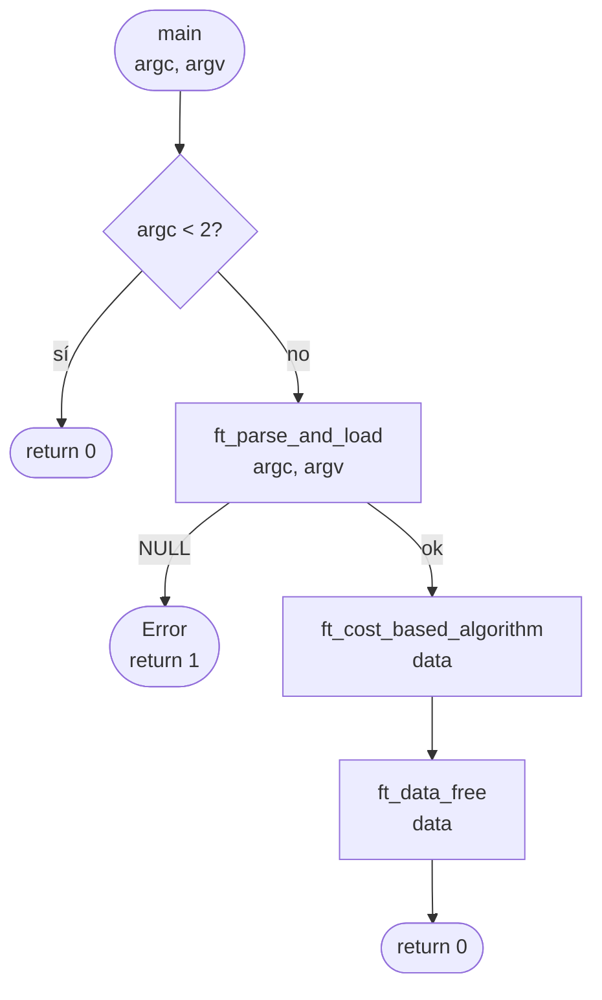
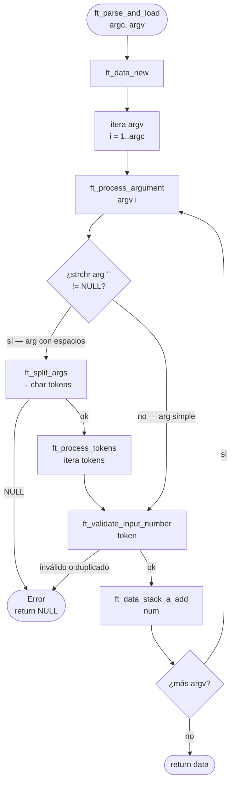
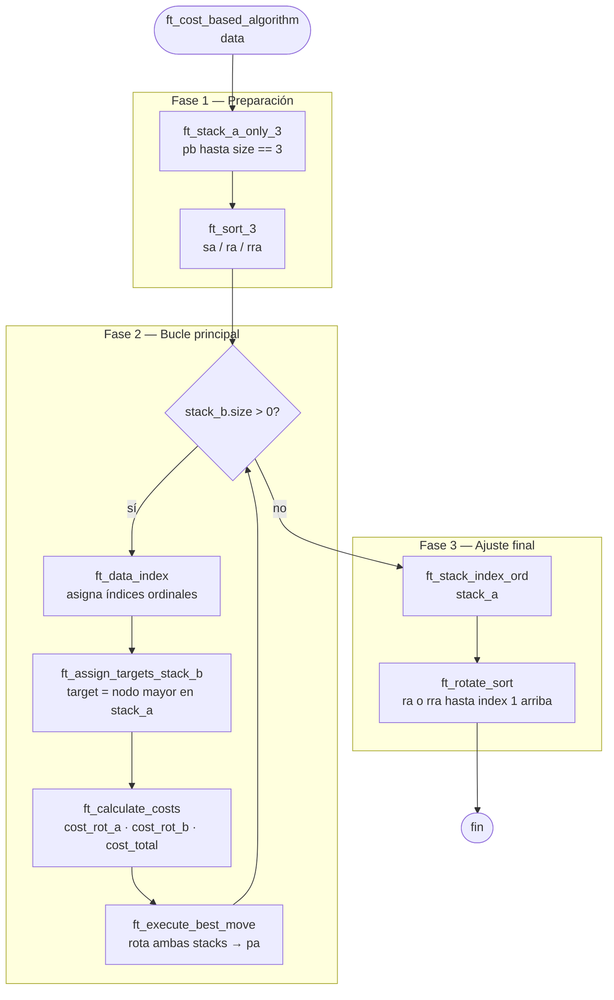
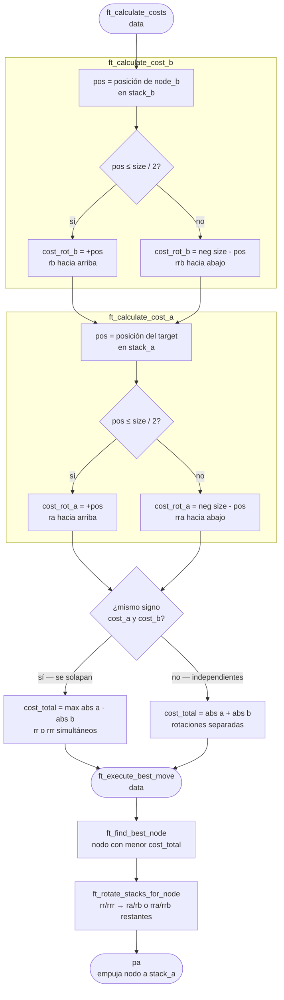

*Este proyecto ha sido creado como parte del currículo de 42 por rjuarez-*

# 📜 Push_Swap

## 📖 Descripción

### Objetivo

Push_Swap es un proyecto de algoritmia de 42 que consiste en ordenar una pila de números enteros usando un conjunto limitado de operaciones sobre dos pilas (A y B), empleando el menor número de movimientos posible.

### Decisiones de diseño

He encapsulado cada parte dividiendo en carpetas cada módulo, agrupando las funciones pequeñas y especializadas en ficheros. En todo momento se usan nombres descriptivos tanto de los módulos, archivos y funciones para facilitar el manejo, mantenimiento, testaje y legibilidad.

#### Estructura de datos

- Al trabajar con listas doblemente enlazadas permite rotaciones circulares en tiempo constante, fundamental para las 11 operaciones del proyecto.
- Incluir en cada nodo los campos especificados para el cálculo de costes consigue unificar y acceder de manera sencilla a los datos necesarios para la toma de decisiones.
- Incluimos en la estructura de cada pila el número de datos que contiene para trabajar con los costes y para saber cuántos números nos quedan por mover.
- Añadir un enlace al nodo destino en A nos ofrece ventajas como inmunidad a las rotaciones intermedias, acceso directo sin necesidad de búsquedas, precisión al eliminar ambigüedades y consistencia al ser el mismo objeto durante todo el proceso.
- Trabajando con un diseño modular y semántico se facilita la autoexplicación de las operaciones, el encapsulamiento de cada stack independientemente de sus nodos y es fácil de mantener la estructura.
- Al optimizar la estructura de datos, minimizamos la memoria usada y los ciclos de procesador necesarios.

##### Data o datos

```c
typedef struct s_data
{
	struct t_stack	*A;
	struct t_stack	*B;
	int				n_nodes;
}	t_data;
```

##### Stack o pila

```c
typedef struct s_stack
{
	struct t_node	*first_node;
	struct t_node	*end_node;
	int				n_size;
}	t_stack;
```

##### Node o nodo

```c
typedef struct s_node
{
	// Datos del nodo
	int				num;
	int				index;
	// Estructura de la lista
	struct t_node	*next;
	struct t_node	*previous;
	// Para cálculo de costes
	int				cost_rot_a;
	int				cost_rot_b;
	int				cost_total;
	// Nodo donde se debe insertar
	struct s_node	*target;
}	t_node;
```

#### Movimientos

Vienen dados en el enunciado del proyecto. En todos los casos, después de hacer el movimiento, se registra el mismo imprimiendo el nombre del movimiento.

##### Push o empujar

- **pa**: Toma el primer elemento de la parte superior de B y lo coloca en la parte superior de A. No hace nada si B está vacío.
- **pb**: Toma el primer elemento de la parte superior de A y lo coloca en la parte superior de B. No hace nada si A está vacío.

##### Swap o intercambio

- **sa**: Intercambia los dos primeros elementos de la parte superior de la pila A. No hace nada si solo hay un elemento o no hay ninguno.
- **sb**: Intercambia los dos primeros elementos de la parte superior de la pila B. No hace nada si solo hay un elemento o no hay ninguno.
- **ss**: sa y sb simultáneamente.

##### Rotate o rotación

- **ra**: Desplaza todos los elementos de la pila A en 1 posición. El primer elemento se convierte en el último.
- **rb**: Desplaza todos los elementos de la pila B en 1 posición. El primer elemento se convierte en el último.
- **rr**: ra y rb simultáneamente.

##### Reverse rotate o rotación inversa

- **rra**: Desplaza todos los elementos de la pila A en 1 posición. El último elemento se convierte en el primero.
- **rrb**: Desplaza todos los elementos de la pila B en 1 posición. El último elemento se convierte en el primero.
- **rrr**: rra y rrb simultáneamente.

#### Carga de datos en la estructura

El parser acepta tanto argumentos separados como strings con múltiples números:

```bash
# Formato 1: Argumentos separados
./push_swap 5 2 8 1 9

# Formato 2: String entre comillas
./push_swap "5 2 8 1 9"

# Formato 3: Mixto
./push_swap 5 2 "8 1" 9
```

El subject de 42 requiere soportar ambos formatos. Para lograrlo, el parser:

- Detecta si un argumento contiene espacios usando `ft_strchr()`
- Si tiene espacios, lo divide en tokens usando `ft_split_args()`
- Si no tiene espacios, lo procesa como un número individual

Para ello se usa una validación a tres niveles:

1. Validación de formato con `ft_is_valid_token()`.
2. Validación de rango usando `ft_atol()` y comprobando que el número resultante está en rango INT.
3. Validación de duplicados con `ft_is_duplicate()`.

Ante cualquier error, se libera memoria.

#### Algoritmo de Ordenación

El algoritmo implementa una estrategia de costo mínimo para ordenar la pila, moviendo elementos entre A y B hasta que todo esté ordenado.

##### Preparación de pilas

1. **Reducimos la pila A a 3 nodos.**
   - Caso base manejable: 3 elementos tienen solo 5 combinaciones posibles.
   - Eficiencia: Es el tamaño máximo que podemos ordenar con un número fijo de operaciones.
   - Simplicidad: El algoritmo de 3 elementos es trivial y rápido.
2. **Ordenar pila A de 3 nodos.**
   - Normalización: Convierte números arbitrarios en índices 1..n.
   - Comparación simplificada: el índice es más fácil de comparar que los valores originales.
   - Target finding: buscar el número justo mayor se vuelve buscar el índice justo mayor.

##### Ordenación

Esta parte se itera hasta que no tengamos nodos en B:

1. **Indexamos.** Los índices cambian cuando se mueven nodos; recalcular desde cero es más simple que mantenerlos incrementalmente.
2. **Buscar nodo destino.** Insertar un número después del justo mayor preserva el orden ascendente. Si es el número más grande, va al principio (wrap around).
3. **Cálculo de costes.**
   - Dirección clara: `+` = rotación normal (`ra`/`rb`), `-` = reverse (`rra`/`rrb`).
   - Optimización de rotaciones conjuntas: mismo signo = usar `rr`/`rrr`, ahorrando hasta un 50% de operaciones.
4. **Ejecución del movimiento con menor costo.** Selección lineal O(n), suficiente para el tamaño del problema (500-1000 elementos). Orden lógico: conjuntas → individuales → `pa`.

##### Organización final de pila A

1. **Reindexación de A**, necesaria al pasar el último nodo de B.
2. **Rotar hasta ordenar.** El subject pide que al final el menor esté arriba. Siempre se rota por el lado más corto (`ra` o `rra`), garantizando el mínimo de rotaciones.

---

### Implementación

| Módulo | Archivos | Funciones principales | Propósito |
|--------|----------|----------------------|-----------|
| Data | 6 | `ft_data_new`, `ft_stack_*` | Gestión de estructuras de datos |
| Algorithm | 6 | `ft_cost_based_algorithm` | Lógica de ordenación |
| Moves | 6 | `sa`, `sb`, `pa`, `pb`, `ra`, `rb`, `rra`, `rrb` | Operaciones del push swap |
| Parser | 4 | `ft_parse_and_load` | Validación y carga de entrada |
| Libft | 40+ | `ft_abs`, `ft_atol`, `ft_recalloc` | Funciones base reutilizables |
| Ft_Printf | 5 | `ft_printf` | Impresión formateada |

#### Diagrama de flujo — `push_swap.c`



#### 📂 Estructura de ficheros

```
│
├── push_swap.h
├── push_swap.c
├── Makefile
├── README.md
│
└── 📁 src
    ├── 📁 data
    │   ├── data.h
    │   ├── data.c
    │   │   ├── t_data  *ft_data_new(void);
    │   │   ├── int     ft_data_free(t_data *data);
    │   │   ├── void    ft_data_index(t_data *data);
    │   │   ├── int     ft_data_stack_a_add(t_data *data, int nbr);
    │   │   └── int     ft_data_stack_b_add(t_data *data, int nbr);
    │   │
    │   ├── node.c
    │   │   ├── t_node  *ft_node_new(int nbr);
    │   │   └── int     ft_node_free(t_node *node);
    │   │
    │   ├── stack.c
    │   │   ├── t_stack *ft_stack_new(void);
    │   │   ├── int     ft_stack_free(t_stack *stack);
    │   │   ├── void    ft_stack_index_ord(t_stack *stack);
    │   │   ├── int     ft_stack_add(t_stack *stack, t_node *node);
    │   │   └── t_node  *ft_stack_pop(t_stack *stack);
    │   │
    │   └── stack_utils.c
    │       ├── int     ft_stack_add_last(t_stack *stack, t_node *node);
    │       ├── t_node  *ft_stack_pop_last(t_stack *stack);
    │       ├── void    ft_stack_index_clear(t_stack *stack);
    │       └── int     ft_is_sort_stack(t_stack *stack);
    │
    ├── 📁 parser
    │   ├── parser.h
    │   ├── parser.c
    │   │   ├── static int  ft_process_tokens(t_data *data, char **tokens);
    │   │   ├── static int  ft_process_argument(t_data *data, char *arg);
    │   │   └── t_data      *ft_parse_and_load(int argc, char **argv);
    │   │
    │   ├── split_args.c
    │   │   ├── void        ft_free_split(char **tokens);
    │   │   ├── static int  ft_count_tokens(char *str);
    │   │   ├── static char *ft_copy_token(char *str, int *i);
    │   │   └── char        **ft_split_args(char *str);
    │   │
    │   └── validate.c
    │       ├── int ft_is_valid_token(char *str);
    │       ├── int ft_is_duplicate(t_stack *stack, int value);
    │       └── int ft_validate_input_number(t_data *data, char *str, int *num);
    │
    ├── 📁 moves
    │   ├── moves.h
    │   ├── swap.c
    │   │   ├── void    sa(t_data *data);
    │   │   ├── void    sb(t_data *data);
    │   │   ├── void    ss(t_data *data);
    │   │   └── void    ft_swap(t_stack *stack);
    │   │
    │   ├── push.c
    │   │   ├── void    pa(t_data *data);
    │   │   ├── void    pb(t_data *data);
    │   │   └── void    ft_push(t_stack *stack_ori, t_stack *stack_des);
    │   │
    │   ├── rotate.c
    │   │   ├── void    ra(t_data *data);
    │   │   ├── void    rb(t_data *data);
    │   │   ├── void    rr(t_data *data);
    │   │   └── void    ft_rotate(t_stack *stack);
    │   │
    │   ├── reverse_rotate.c
    │   │   ├── void    rra(t_data *data);
    │   │   ├── void    rrb(t_data *data);
    │   │   ├── void    rrr(t_data *data);
    │   │   └── void    ft_reverse_rotate(t_stack *stack);
    │   │
    │   └── moves_utils.c
    │       └── void    ft_register(char *mov);
    │
    ├── 📁 algorithm
    │   ├── algorithm.h
    │   ├── algorithm.c
    │   │   ├── void    ft_rotate_sort(t_data *data);
    │   │   └── void    ft_cost_based_algorithm(t_data *data);
    │   │
    │   ├── first_step.c
    │   │   ├── void    ft_stack_a_only_3(t_data *data);
    │   │   └── void    ft_sort_3(t_data *data);
    │   │
    │   ├── target.c
    │   │   ├── void    ft_find_node_target(t_stack *stack_a, t_node *node_b);
    │   │   └── void    ft_assign_targets_stack_b(t_data *data);
    │   │
    │   ├── cost.c
    │   │   ├── int     ft_get_node_position_in_stack(t_stack *stack, t_node *node);
    │   │   ├── void    ft_calculate_cost_b(t_stack *stack_b, t_node *node_b);
    │   │   ├── void    ft_calculate_cost_a(t_stack *stack_a, t_node *node_b);
    │   │   └── void    ft_calculate_costs(t_data *data);
    │   │
    │   └── execute_best_move.c
    │       ├── t_node  *ft_find_best_node(t_stack *stack_b);
    │       ├── void    ft_rotate_stack_a(t_data *data, int *cost_a);
    │       ├── void    ft_rotate_stack_b(t_data *data, int *cost_b);
    │       ├── void    ft_rotate_stacks_for_node(t_data *data, t_node *best_node);
    │       └── void    ft_execute_best_move(t_data *data);
    │
    ├── 📁 libft
    │   ├── libft.h
    │   ├── ft_abs.c
    │   │   └── int     ft_abs(int num);
    │   ├── ft_atol.c
    │   │   └── long    ft_atol(const char *str);
    │   └── ft_recalloc.c
    │       └── void    *ft_recalloc(unsigned char *old_ptr, unsigned long int new_size);
    │
    └── 📁 ft_printf
        ├── ft_printf.h
        ├── ft_printf.c
        │   ├── int     ft_type_check(char chr, va_list p);
        │   ├── int     ft_printf(const char *format, ...);
        │   └── char    *ft_strtoup(char **text);
        ├── ft_conver_numbers.c
        │   ├── char    ft_conver_digital(unsigned char c);
        │   ├── int     ft_intlen_base(long long int nbr, int base);
        │   ├── unsigned long int ft_uabs(long long int nbr);
        │   └── char    *ft_conver_nbr_base(long long int nbr, int base);
        ├── ft_conver.c
        │   ├── char    *ft_conver_null(char chr);
        │   ├── int     ft_conver_c(int chr);
        │   ├── char    *ft_conver_s(char *str);
        │   └── char    *ft_conver_p(void *ptr);
        └── ft_puts.c
            ├── void    ft_putchr_fd(char c, int fd);
            └── int     ft_puts_fd(char **text, int fd);
```

---

## 📦 Módulo Data

### 📄 data.c

#### FT_DATA_NEW — `t_data *ft_data_new(void)`

	DEFINICIÓN: Crea e inicializa una nueva estructura t_data con stacks A y B vacíos
	PARÁMETROS: Ninguno
	RETORNO: {t_data*}
		- Correcto:  Puntero a la nueva estructura t_data inicializada
		- Incorrecto: NULL si falla la asignación de memoria
	COMPORTAMIENTO:
		1. Asigna memoria para t_data
		2. Crea stack_a con ft_stack_new()
		3. Crea stack_b con ft_stack_new()
		4. Inicializa n_nodes a 0

#### FT_DATA_FREE — `int ft_data_free(t_data *data)`

	DEFINICIÓN: Libera toda la memoria asociada a la estructura t_data y sus stacks
	PARÁMETROS:
		{t_data*} data - Puntero a la estructura a liberar
	RETORNO: {int}
		- Correcto:  TRUE (1) si se liberó correctamente
		- Incorrecto: FALSE (0) si data es NULL
	COMPORTAMIENTO:
		1. Verifica que data no sea NULL
		2. Libera stack_a con ft_stack_free()
		3. Libera stack_b con ft_stack_free()
		4. Establece n_nodes a 0
		5. Libera data

#### FT_DATA_INDEX — `void ft_data_index(t_data *data)`

	DEFINICIÓN: Asigna índices ordinales a todos los nodos de stack A y stack B
	PARÁMETROS:
		{t_data*} data - Estructura que contiene los stacks
	RETORNO: void
	COMPORTAMIENTO:
		1. Indexa stack A con ft_stack_index_ord()
		2. Si stack B existe y no está vacío, asigna índices secuenciales (1, 2, 3...)

#### FT_DATA_STACK_A_ADD — `int ft_data_stack_a_add(t_data *data, int nbr)`

	DEFINICIÓN: Crea un nuevo nodo con el número dado y lo añade al final del stack A
	PARÁMETROS:
		{t_data*} data - Estructura que contiene stack A
		{int} nbr      - Número a almacenar en el nodo
	RETORNO: {int}
		- Correcto:  TRUE (1) si se creó y añadió correctamente
		- Incorrecto: FALSE (0) si data es NULL, falla la creación del stack o del nodo
	COMPORTAMIENTO:
		1. Verifica que data no sea NULL
		2. Si stack A no existe, lo crea
		3. Crea nuevo nodo con ft_node_new()
		4. Añade nodo al final del stack con ft_stack_add_last()
		5. Incrementa n_nodes

#### FT_DATA_STACK_B_ADD — `int ft_data_stack_b_add(t_data *data, int nbr)`

	DEFINICIÓN: Crea un nuevo nodo con el número dado y lo añade al principio del stack B
	PARÁMETROS:
		{t_data*} data - Estructura que contiene stack B
		{int} nbr      - Número a almacenar en el nodo
	RETORNO: {int}
		- Correcto:  TRUE (1) si se creó y añadió correctamente
		- Incorrecto: FALSE (0) si data es NULL, falla la creación del stack o del nodo
	COMPORTAMIENTO:
		1. Verifica que data no sea NULL
		2. Si stack B no existe, lo crea
		3. Crea nuevo nodo con ft_node_new()
		4. Añade nodo al principio del stack con ft_stack_add()
		5. Incrementa n_nodes

---

### 📄 stack.c

#### FT_STACK_NEW — `t_stack *ft_stack_new(void)`

	DEFINICIÓN: Crea e inicializa una nueva estructura t_stack vacía
	PARÁMETROS: Ninguno
	RETORNO: {t_stack*}
		- Correcto:  Puntero a la nueva estructura t_stack
		- Incorrecto: NULL si falla la asignación de memoria
	COMPORTAMIENTO:
		1. Asigna memoria para t_stack
		2. Inicializa first_node a NULL
		3. Inicializa end_node a NULL
		4. Inicializa size a 0

#### FT_STACK_FREE — `int ft_stack_free(t_stack *stack)`

	DEFINICIÓN: Libera la memoria del stack y de todos sus nodos
	PARÁMETROS:
		{t_stack*} stack - Puntero al stack a liberar
	RETORNO: {int}
		- Correcto:  TRUE (1) si se liberó correctamente
		- Incorrecto: FALSE (0) si stack es NULL
	COMPORTAMIENTO:
		1. Extrae y elimina todos los nodos del stack con ft_stack_pop()
		2. Libera cada nodo con ft_node_free()
		3. Libera la estructura del stack

#### FT_STACK_INDEX_ORD — `void ft_stack_index_ord(t_stack *stack)`

	DEFINICIÓN: Asigna índices ordinales (1..n) a los nodos del stack basados en sus valores numéricos
	PARÁMETROS:
		{t_stack*} stack - Stack a indexar
	RETORNO: void
	COMPORTAMIENTO:
		1. Limpia los índices existentes con ft_stack_index_clear()
		2. Itera desde i=1 hasta size del stack
		3. En cada iteración, encuentra el nodo con el valor mínimo no indexado
		4. Asigna el índice i a ese nodo
	EJEMPLO: [42, 7, 99, 23, 5] → índices [4, 2, 5, 3, 1]

#### FT_STACK_ADD — `int ft_stack_add(t_stack *stack, t_node *node)`

	DEFINICIÓN: Añade un nodo al principio del stack
	PARÁMETROS:
		{t_stack*} stack - Stack donde añadir el nodo
		{t_node*}  node  - Nodo a añadir
	RETORNO: {int}
		- Correcto:  TRUE (1) si se añadió correctamente
		- Incorrecto: FALSE (0) si stack o node es NULL
	COMPORTAMIENTO:
		1. Verifica parámetros
		2. Si el stack está vacío, el nodo es first y end
		3. Si no, el nuevo nodo apunta al antiguo first_node
		4. Actualiza first_node al nuevo nodo
		5. Incrementa size

#### FT_STACK_POP — `t_node *ft_stack_pop(t_stack *stack)`

	DEFINICIÓN: Extrae y retorna el primer nodo del stack
	PARÁMETROS:
		{t_stack*} stack - Stack del que extraer el nodo
	RETORNO: {t_node*}
		- Correcto:  Puntero al nodo extraído
		- Incorrecto: NULL si stack es NULL o está vacío
	COMPORTAMIENTO:
		1. Verifica que el stack no esté vacío
		2. Guarda referencia al first_node
		3. Actualiza first_node al siguiente nodo
		4. Si el stack queda vacío, end_node también es NULL
		5. Decrementa size
		6. Desconecta el nodo extraído (next y previous a NULL)

---

### 📄 stack_utils.c

#### FT_STACK_ADD_LAST — `int ft_stack_add_last(t_stack *stack, t_node *node)`

	DEFINICIÓN: Añade un nodo al final del stack
	PARÁMETROS:
		{t_stack*} stack - Stack donde añadir el nodo
		{t_node*}  node  - Nodo a añadir
	RETORNO: {int}
		- Correcto:  TRUE (1) si se añadió correctamente
		- Incorrecto: FALSE (0) si stack o node es NULL
	COMPORTAMIENTO:
		1. Verifica parámetros
		2. Si el stack está vacío, el nodo es first y end
		3. Si no, el antiguo end_node apunta al nuevo nodo
		4. Actualiza end_node al nuevo nodo
		5. Incrementa size

#### FT_STACK_POP_LAST — `t_node *ft_stack_pop_last(t_stack *stack)`

	DEFINICIÓN: Extrae y retorna el último nodo del stack
	PARÁMETROS:
		{t_stack*} stack - Stack del que extraer el nodo
	RETORNO: {t_node*}
		- Correcto:  Puntero al nodo extraído
		- Incorrecto: NULL si stack es NULL o está vacío
	COMPORTAMIENTO:
		1. Verifica que el stack no esté vacío
		2. Guarda referencia al end_node
		3. Actualiza end_node al nodo anterior
		4. Si el stack queda vacío, first_node también es NULL
		5. Decrementa size
		6. Desconecta el nodo extraído

#### FT_STACK_INDEX_CLEAR — `void ft_stack_index_clear(t_stack *stack)`

	DEFINICIÓN: Establece el índice de todos los nodos del stack a 0
	PARÁMETROS:
		{t_stack*} stack - Stack cuyos índices limpiar
	RETORNO: void
	COMPORTAMIENTO:
		1. Recorre todos los nodos del stack
		2. Asigna index = 0 a cada uno

#### FT_IS_SORT_STACK — `int ft_is_sort_stack(t_stack *stack)`

	DEFINICIÓN: Verifica si el stack está ordenado circularmente según los índices
	PARÁMETROS:
		{t_stack*} stack - Stack a verificar
	RETORNO: {int}
		- Correcto:  TRUE (1) si está ordenado circularmente
		- Incorrecto: FALSE (0) si no está ordenado
	COMPORTAMIENTO:
		1. Encuentra el nodo con índice 1
		2. Verifica que los índices sigan el orden circular ascendente

---

### 📄 node.c

#### FT_NODE_NEW — `t_node *ft_node_new(int nbr)`

	DEFINICIÓN: Crea e inicializa un nuevo nodo con el número dado
	PARÁMETROS:
		{int} nbr - Número a almacenar en el nodo
	RETORNO: {t_node*}
		- Correcto:  Puntero al nuevo nodo inicializado
		- Incorrecto: NULL si falla la asignación de memoria
	COMPORTAMIENTO:
		1. Asigna memoria para t_node
		2. Inicializa num con nbr
		3. Inicializa next y previous a NULL
		4. Inicializa index a 0
		5. Inicializa target a NULL
		6. Inicializa cost_rot_a, cost_rot_b, cost_total a 0

#### FT_NODE_FREE — `int ft_node_free(t_node *node)`

	DEFINICIÓN: Libera la memoria de un nodo
	PARÁMETROS:
		{t_node*} node - Nodo a liberar
	RETORNO: {int}
		- Correcto:  TRUE (1) si se liberó correctamente
		- Incorrecto: FALSE (0) si node es NULL
	COMPORTAMIENTO:
		1. Verifica que node no sea NULL
		2. Libera la memoria del nodo

---

## 📦 Módulo Parser

### 🔄 Diagrama de flujo



### 📄 parser.c

#### FT_PARSE_AND_LOAD — `t_data *ft_parse_and_load(int argc, char **argv)`

	DEFINICIÓN: Procesa los argumentos de línea de comandos y carga los números en data
	PARÁMETROS:
		{int}    argc - Número de argumentos
		{char**} argv - Array de argumentos
	RETORNO: {t_data*}
		- Correcto:  Puntero a t_data con los números cargados
		- Incorrecto: NULL si hay error o falla memoria
	COMPORTAMIENTO:
		1. Crea una nueva estructura t_data
		2. Itera sobre los argumentos (desde argv[1])
		3. Para cada argumento, llama a ft_process_argument()
		4. Si hay error, libera todo y retorna NULL

#### FT_PROCESS_ARGUMENT — `static int ft_process_argument(t_data *data, char *arg)`

	DEFINICIÓN: Procesa un argumento individual (puede contener múltiples números)
	PARÁMETROS:
		{t_data*} data - Estructura donde cargar los datos
		{char*}   arg  - Argumento a procesar
	RETORNO: {int}
		- Correcto:  FALSE (0) si se procesó correctamente
		- Incorrecto: TRUE (1) si hay error
	COMPORTAMIENTO:
		1. Si el argumento contiene espacios, lo divide en tokens con ft_split_args()
		2. Procesa cada token con ft_process_tokens()
		3. Si no contiene espacios, lo valida como número individual

#### FT_PROCESS_TOKENS — `static int ft_process_tokens(t_data *data, char **tokens)`

	DEFINICIÓN: Procesa un array de tokens (números en string)
	PARÁMETROS:
		{t_data*} data   - Estructura donde cargar los datos
		{char**}  tokens - Array de strings con números
	RETORNO: {int}
		- Correcto:  FALSE (0) si se procesó correctamente
		- Incorrecto: TRUE (1) si hay error
	COMPORTAMIENTO:
		1. Itera sobre cada token
		2. Valida y convierte cada token a número
		3. Añade el número a stack A

---

### 📄 split_args.c

#### FT_SPLIT_ARGS — `char **ft_split_args(char *str)`

	DEFINICIÓN: Divide un string con números separados por espacios en un array de tokens
	PARÁMETROS:
		{char*} str - String a dividir
	RETORNO: {char**}
		- Correcto:  Array NULL-terminated de tokens
		- Incorrecto: NULL si falla memoria
	COMPORTAMIENTO:
		1. Cuenta el número de tokens en el string
		2. Asigna memoria para el array de tokens
		3. Copia cada token individualmente
		4. Termina el array con NULL

#### FT_COUNT_TOKENS — `static int ft_count_tokens(char *str)`

	DEFINICIÓN: Cuenta cuántos tokens hay en un string
	PARÁMETROS:
		{char*} str - String a analizar
	RETORNO: {int} - Número de tokens encontrados
	COMPORTAMIENTO:
		1. Itera sobre el string
		2. Ignora espacios
		3. Cada secuencia de no-espacios cuenta como un token

#### FT_COPY_TOKEN — `static char *ft_copy_token(char *str, int *i)`

	DEFINICIÓN: Copia un token desde una posición del string
	PARÁMETROS:
		{char*} str - String fuente
		{int*}  i   - Puntero a la posición actual (se actualiza)
	RETORNO: {char*}
		- Correcto:  String con el token copiado
		- Incorrecto: NULL si falla memoria
	COMPORTAMIENTO:
		1. Avanza hasta encontrar el inicio del token
		2. Calcula la longitud del token
		3. Copia el token a nueva memoria

#### FT_FREE_SPLIT — `void ft_free_split(char **tokens)`

	DEFINICIÓN: Libera la memoria de un array de tokens creado con ft_split_args
	PARÁMETROS:
		{char**} tokens - Array de tokens a liberar
	RETORNO: void
	COMPORTAMIENTO:
		1. Itera sobre el array liberando cada token
		2. Libera el array principal

---

### 📄 validate.c

#### FT_IS_VALID_TOKEN — `int ft_is_valid_token(char *str)`

	DEFINICIÓN: Verifica si un token es un número válido
	PARÁMETROS:
		{char*} str - Token a validar
	RETORNO: {int}
		- Correcto:  TRUE (1) si el token es válido
		- Incorrecto: FALSE (0) si es inválido
	VALIDACIONES:
		- No puede estar vacío
		- Puede tener un signo (+ o -) al inicio
		- Después del signo, solo dígitos
		- No puede tener caracteres no numéricos
	EJEMPLOS VÁLIDOS:   "42", "+42", "-5"
	EJEMPLOS INVÁLIDOS: "", "+", "-", "42a", "  5"

#### FT_IS_DUPLICATE — `int ft_is_duplicate(t_stack *stack, int value)`

	DEFINICIÓN: Verifica si un valor ya existe en el stack
	PARÁMETROS:
		{t_stack*} stack - Stack donde buscar
		{int}      value - Valor a buscar
	RETORNO: {int}
		- Correcto:  TRUE (1) si el valor es duplicado
		- Incorrecto: FALSE (0) si no existe
	COMPORTAMIENTO:
		1. Recorre todos los nodos del stack
		2. Compara node->num con value
		3. Si encuentra coincidencia, retorna TRUE

#### FT_VALIDATE_INPUT_NUMBER — `int ft_validate_input_number(t_data *data, char *str, int *num)`

	DEFINICIÓN: Valida un número y lo almacena si es correcto
	PARÁMETROS:
		{t_data*} data - Estructura que contiene stack A para verificar duplicados
		{char*}   str  - String con el número a validar
		{int*}    num  - Puntero donde almacenar el número validado
	RETORNO: {int}
		- Correcto:  FALSE (0) si la validación es exitosa
		- Incorrecto: TRUE (1) si hay error
	VALIDACIONES:
		1. Formato válido (ft_is_valid_token)
		2. Rango dentro de INT_MIN e INT_MAX (usando ft_atol)
		3. No duplicado en stack A

---

## 📦 Módulo Moves

### 📄 push.c

#### FT_PUSH — `void ft_push(t_stack *stack_ori, t_stack *stack_des)`

	DEFINICIÓN: Extrae un nodo del stack origen y lo añade al destino
	PARÁMETROS:
		{t_stack*} stack_ori - Stack origen (del que se extrae)
		{t_stack*} stack_des - Stack destino (donde se añade)
	RETORNO: void
	COMPORTAMIENTO:
		1. Extrae el primer nodo de stack_ori con ft_stack_pop()
		2. Si el nodo existe, lo añade al principio de stack_des con ft_stack_add()

#### PA — `void pa(t_data *data)`

	DEFINICIÓN: Mueve el primer elemento de stack B a stack A
	COMPORTAMIENTO:
		1. Verifica que stack B no esté vacío
		2. Ejecuta ft_push() de B a A
		3. Registra el movimiento "pa"

#### PB — `void pb(t_data *data)`

	DEFINICIÓN: Mueve el primer elemento de stack A a stack B
	COMPORTAMIENTO:
		1. Verifica que stack A no esté vacío
		2. Ejecuta ft_push() de A a B
		3. Registra el movimiento "pb"

---

### 📄 swap.c

#### FT_SWAP — `void ft_swap(t_stack *stack)`

	DEFINICIÓN: Intercambia los dos primeros elementos del stack
	COMPORTAMIENTO:
		1. Verifica que el stack tenga al menos 2 elementos
		2. Extrae los dos primeros nodos con ft_stack_pop()
		3. Los vuelve a añadir en orden inverso

#### SA — `void sa(t_data *data)`
	Intercambia los dos primeros elementos de stack A. Registra "sa".

#### SB — `void sb(t_data *data)`
	Intercambia los dos primeros elementos de stack B. Registra "sb".

#### SS — `void ss(t_data *data)`
	Ejecuta sa y sb simultáneamente. Registra "ss".

---

### 📄 rotate.c

#### FT_ROTATE — `void ft_rotate(t_stack *stack)`

	DEFINICIÓN: Rota el stack hacia arriba (el primer elemento va al final)
	COMPORTAMIENTO:
		1. Extrae el primer nodo con ft_stack_pop()
		2. Lo añade al final con ft_stack_add_last()

#### RA — `void ra(t_data *data)`
	Rota stack A hacia arriba. Registra "ra".

#### RB — `void rb(t_data *data)`
	Rota stack B hacia arriba. Registra "rb".

#### RR — `void rr(t_data *data)`
	Ejecuta ra y rb simultáneamente. Registra "rr".

---

### 📄 reverse_rotate.c

#### FT_REVERSE_ROTATE — `void ft_reverse_rotate(t_stack *stack)`

	DEFINICIÓN: Rota el stack hacia abajo (el último elemento va al principio)
	COMPORTAMIENTO:
		1. Extrae el último nodo con ft_stack_pop_last()
		2. Lo añade al principio con ft_stack_add()

#### RRA — `void rra(t_data *data)`
	Rota stack A hacia abajo. Registra "rra".

#### RRB — `void rrb(t_data *data)`
	Rota stack B hacia abajo. Registra "rrb".

#### RRR — `void rrr(t_data *data)`
	Ejecuta rra y rrb simultáneamente. Registra "rrr".

---

### 📄 moves_utils.c

#### FT_REGISTER — `void ft_register(char *mov)`

	DEFINICIÓN: Registra (imprime) un movimiento realizado
	PARÁMETROS:
		{char*} mov - String con el nombre del movimiento
	RETORNO: void
	COMPORTAMIENTO:
		1. Imprime el movimiento usando ft_printf()
		2. Añade un salto de línea al final

---

## 📦 Módulo Algorithm

### 🔄 Diagrama de flujo — algoritmo principal



### 🔄 Diagrama de flujo — cálculo de costes y ejecución



---

### 📄 algorithm.c

#### FT_COST_BASED_ALGORITHM — `void ft_cost_based_algorithm(t_data *data)`

	DEFINICIÓN: Algoritmo principal de ordenación basado en cálculo de costes
	PARÁMETROS:
		{t_data*} data - Estructura que contiene los stacks
	RETORNO: void
	COMPORTAMIENTO:
		1. Prepara stack A dejando solo 3 elementos
		2. Ordena esos 3 elementos
		3. Mientras stack B no esté vacío:
		   - Re-indexa los stacks
		   - Asigna targets a los nodos de B
		   - Calcula costes de mover cada nodo
		   - Ejecuta el movimiento de menor coste
		4. Ordena final rotando hasta que el índice 1 quede arriba

#### FT_ROTATE_SORT — `void ft_rotate_sort(t_data *data)`

	DEFINICIÓN: Rota el stack A para dejar el elemento con índice 1 en la cima
	PARÁMETROS:
		{t_data*} data - Estructura que contiene stack A
	RETORNO: void
	COMPORTAMIENTO:
		1. Encuentra la posición del nodo con índice 1
		2. Si está en la mitad superior, usa rra
		3. Si está en la mitad inferior, usa ra
		4. Rota hasta que el índice 1 sea el first_node

---

### 📄 first_step.c

#### FT_STACK_A_ONLY_3 — `void ft_stack_a_only_3(t_data *data)`

	DEFINICIÓN: Reduce el stack A a solo 3 elementos moviendo el resto a B
	PARÁMETROS:
		{t_data*} data - Estructura que contiene los stacks
	RETORNO: void
	COMPORTAMIENTO:
		1. Mientras stack A tenga más de 3 elementos, hace pb
		2. Si quedan exactamente 3, llama a ft_sort_3()
		3. Indexa el stack A resultante

#### FT_SORT_3 — `void ft_sort_3(t_data *data)`

	DEFINICIÓN: Ordena un stack de exactamente 3 elementos
	PARÁMETROS:
		{t_data*} data - Estructura que contiene stack A
	RETORNO: void
	COMPORTAMIENTO: Maneja las 5 permutaciones posibles:

	| Permutación | Operaciones |
	|-------------|-------------|
	| 2, 1, 3     | sa          |
	| 3, 2, 1     | sa + rra    |
	| 3, 1, 2     | ra          |
	| 2, 3, 1     | sa + ra     |
	| 1, 3, 2     | rra         |

---

### 📄 target.c

#### FT_FIND_NODE_TARGET — `void ft_find_node_target(t_stack *stack_a, t_node *node_b)`

	DEFINICIÓN: Encuentra el nodo destino en stack A para un nodo de stack B
	PARÁMETROS:
		{t_stack*} stack_a - Stack A donde buscar el target
		{t_node*}  node_b  - Nodo de stack B que necesita target
	RETORNO: void (establece node_b->target)
	COMPORTAMIENTO:
		1. Busca el nodo en A con el valor justo mayor a node_b->num
		2. Si no existe (node_b es el más grande), toma el nodo con valor mínimo
		3. Asigna ese nodo como target de node_b
	EJEMPLO:
		Stack A: [1, 3, 5, 7, 9]
		node_b->num = 6  → target = 7
		node_b->num = 10 → target = 1 (wrap around)

#### FT_ASSIGN_TARGETS_STACK_B — `void ft_assign_targets_stack_b(t_data *data)`

	DEFINICIÓN: Asigna targets a todos los nodos de stack B
	PARÁMETROS:
		{t_data*} data - Estructura que contiene los stacks
	RETORNO: void
	COMPORTAMIENTO:
		1. Recorre todos los nodos de stack B
		2. Para cada uno, llama a ft_find_node_target()

---

### 📄 cost.c

#### FT_GET_NODE_POSITION_IN_STACK — `int ft_get_node_position_in_stack(t_stack *stack, t_node *node_search)`

	DEFINICIÓN: Obtiene la posición (índice) de un nodo dentro del stack
	PARÁMETROS:
		{t_stack*} stack       - Stack donde buscar
		{t_node*}  node_search - Nodo a localizar
	RETORNO: {int}
		- Correcto:  Posición del nodo (0 = first_node)
		- Incorrecto: -1 si no se encuentra el nodo

#### FT_CALCULATE_COST_B — `void ft_calculate_cost_b(t_stack *stack_b, t_node *node_b)`

	DEFINICIÓN: Calcula el coste de rotación para traer un nodo de B al tope
	PARÁMETROS:
		{t_stack*} stack_b - Stack B que contiene el nodo
		{t_node*}  node_b  - Nodo a evaluar
	RETORNO: void (establece node_b->cost_rot_b)
	COMPORTAMIENTO:
		1. Obtiene la posición del nodo en stack B
		2. Si posición ≤ size/2: coste = +posición (usar rb)
		3. Si posición > size/2: coste = -(size - posición) (usar rrb)
	EJEMPLO:
		Stack B size 5, nodo en posición 4:
		4 > 2.5 → cost_rot_b = -(5-4) = -1  (1 rrb)

#### FT_CALCULATE_COST_A — `void ft_calculate_cost_a(t_stack *stack_a, t_node *node_b)`

	DEFINICIÓN: Calcula el coste de rotación para traer el target de A al tope
	PARÁMETROS:
		{t_stack*} stack_a - Stack A que contiene el target
		{t_node*}  node_b  - Nodo de B cuyo target evaluamos
	RETORNO: void (establece node_b->cost_rot_a)
	COMPORTAMIENTO:
		1. Obtiene la posición del target en stack A
		2. Si posición ≤ size/2: coste = +posición (usar ra)
		3. Si posición > size/2: coste = -(size - posición) (usar rra)

#### FT_CALCULATE_COSTS — `void ft_calculate_costs(t_data *data)`

	DEFINICIÓN: Calcula el coste total de mover cada nodo de B a A
	PARÁMETROS:
		{t_data*} data - Estructura que contiene los stacks
	RETORNO: void
	COMPORTAMIENTO:
		1. Para cada nodo de B, calcula cost_rot_a y cost_rot_b
		2. Calcula coste total según la fórmula:
		   - Si misma dirección: max(|cost_a|, |cost_b|)
		   - Si direcciones opuestas: |cost_a| + |cost_b|

---

### 📄 execute_best_move.c

#### FT_FIND_BEST_NODE — `t_node *ft_find_best_node(t_stack *stack_b)`

	DEFINICIÓN: Encuentra el nodo de B con el menor coste total
	PARÁMETROS:
		{t_stack*} stack_b - Stack B donde buscar
	RETORNO: {t_node*} - Puntero al nodo con menor coste total
	COMPORTAMIENTO:
		1. Recorre todos los nodos de B
		2. Compara cost_total de cada uno
		3. Retorna el que tiene el valor más bajo

#### FT_ROTATE_STACK_A — `void ft_rotate_stack_a(t_data *data, int *cost_a)`

	DEFINICIÓN: Ejecuta las rotaciones necesarias en stack A según el coste
	COMPORTAMIENTO:
		1. Mientras cost_a > 0: ejecuta ra() y decrementa cost_a
		2. Mientras cost_a < 0: ejecuta rra() e incrementa cost_a

#### FT_ROTATE_STACK_B — `void ft_rotate_stack_b(t_data *data, int *cost_b)`

	DEFINICIÓN: Ejecuta las rotaciones necesarias en stack B según el coste
	COMPORTAMIENTO:
		1. Mientras cost_b > 0: ejecuta rb() y decrementa cost_b
		2. Mientras cost_b < 0: ejecuta rrb() e incrementa cost_b

#### FT_ROTATE_STACKS_FOR_NODE — `void ft_rotate_stacks_for_node(t_data *data, t_node *best_node)`

	DEFINICIÓN: Ejecuta rotaciones conjuntas y luego individuales para un nodo
	PARÁMETROS:
		{t_data*} data      - Estructura que contiene los stacks
		{t_node*} best_node - Nodo óptimo a mover
	RETORNO: void
	COMPORTAMIENTO:
		1. Mientras ambos costes sean positivos: ejecuta rr()
		2. Mientras ambos costes sean negativos: ejecuta rrr()
		3. Ejecuta rotaciones individuales restantes en A y B

#### FT_EXECUTE_BEST_MOVE — `void ft_execute_best_move(t_data *data)`

	DEFINICIÓN: Encuentra y ejecuta el movimiento de menor coste
	PARÁMETROS:
		{t_data*} data - Estructura que contiene los stacks
	RETORNO: void
	COMPORTAMIENTO:
		1. Encuentra el mejor nodo con ft_find_best_node()
		2. Rota ambos stacks para dejar el nodo y su target en la cima
		3. Ejecuta pa() para mover el nodo de B a A

---

## 📦 Módulo Libft

Solo se incluyen las funciones nuevas respecto al proyecto libft original.

### 📄 ft_abs.c

#### FT_ABS — `int ft_abs(int num)`

	DEFINICIÓN: Retorna el valor absoluto de un número entero
	PARÁMETROS:
		{int} num - Número a convertir
	RETORNO: {int} - Valor absoluto del número
	COMPORTAMIENTO:
		- Si num ≥ 0, retorna num
		- Si num < 0, retorna -num

### 📄 ft_atol.c

#### FT_ATOL — `long ft_atol(const char *str)`

	DEFINICIÓN: Convierte un string a long integer
	PARÁMETROS:
		{const char*} str - String a convertir
	RETORNO: {long} - Valor convertido
	COMPORTAMIENTO:
		1. Ignora espacios al inicio
		2. Procesa signo opcional (+ o -)
		3. Convierte dígitos a número
		4. Retorna el resultado como long

### 📄 ft_recalloc.c

#### FT_RECALLOC — `void *ft_recalloc(unsigned char *old_ptr, unsigned long int new_size)`

	DEFINICIÓN: Realiza realloc con inicialización a cero de la memoria nueva
	PARÁMETROS:
		{unsigned char*}      old_ptr  - Puntero antiguo a redimensionar
		{unsigned long int}   new_size - Nuevo tamaño en bytes
	RETORNO: {void*}
		- Correcto:  Puntero a la nueva memoria
		- Incorrecto: NULL si falla la asignación
	COMPORTAMIENTO:
		1. Asigna nueva memoria con ft_calloc() (inicializada a cero)
		2. Copia el contenido antiguo a la nueva memoria
		3. Libera la memoria antigua
		4. Retorna el nuevo puntero

---

## 📦 Módulo Ft_printf

Como es el mismo proyecto original, no se desglosa.

---

## ⚙️ Instrucciones

### Compilación

Al tener fichero Makefile, solo hace falta compilar mediante el comando `make`. La configuración de la compilación con las banderas estándar y demás parámetros está en el propio fichero Makefile.

```bash
make
```

Esto generará el ejecutable `push_swap`.

| Regla | Descripción |
|-------|-------------|
| `make` / `make all` | Compila el programa |
| `make clean` | Elimina los archivos objeto (.o) |
| `make fclean` | Elimina los archivos objeto y el ejecutable |
| `make re` | Recompila completamente el proyecto |

### Uso

```bash
./push_swap 5 2 8 1 9
./push_swap "5 2 8 1 9"
./push_swap 5 2 "8 1" 9
```

---

## 📚 Recursos

### Referencias clásicas

- Investigación de los diferentes métodos de ordenación.
- Consulta de libros de C, estructura de datos y algoritmia.
- Consulta a otros proyectos de alumnos.

### Uso de la IA

- Evaluación de las diferentes estructuras de datos.
- Evaluación de los diferentes algoritmos de ordenación y explicaciones paso a paso para entender su funcionamiento.
- Elaboración de los diagramas de flujo para el README.
- Traducir el fichero Readme.
- Automatización de las descripciones de las funciones de cada fichero.
