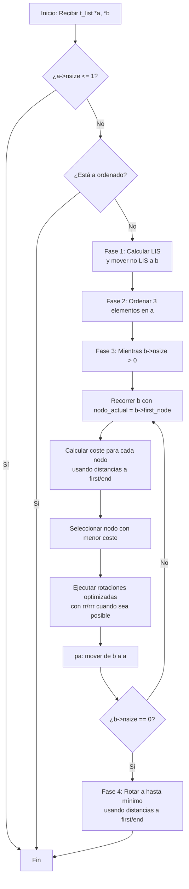

*Este proyecto ha sido creado como parte del currículo de 42 por rjuarez-*
# 📜 get_next_line

## 📖 Descripción

### Objetivo:

### Decisiones de diseño

#### Estructura de datos
##### Stack o pila
```code
typedef struct s_list
{
	struct t_node	*first_node;
	struct t_node	*end_node;
	int				nsize;
}		t_list;
```

##### Node o nodo
```code
typedef struct s_node
{
	struct t_node	*next;
	struct t_node	*previous;
	int				num;
	int				index;
}		t_node;
```
#### Movimientos

##### Swap o intercambio
_*sa:*_ <br>
Intercambia los dos primeros elementos de la parte superior de la pila a.
No haces nada si solo hay un elemento o no hay ninguno.<br>
_*sb*_ <br>
Intercambia los dos primeros elementos de la parte superior de la pila b.
No haces nada si solo hay un elemento o no hay ninguno.<br>
_*ss:*_<br> sa y sb simultáneamente.

##### Push o empujar
-*pa:*_<br>Toma el primer elemento de la parte superior de b y colócalo en
la parte superior de a. No haces nada si b está vacío. <br>
_*pb:*_<br>Toma el primer elemento en la parte superior de a y colócalo en
la parte superior de b. No hacer nada si a está vacío. <br>

##### Rotate o rotacion
_*ra:*_<br>Desplaza todos los elementos de la pila a en 1 posición.
El primer elemento se convierte en el último.<br>
_*rb:*_<br>Desplaza todos los elementos de la pila b en 1 posición.
El primer elemento se convierte en el último.<br>
_*rr:*_<br>ra y rb simultáneamente.<br>

##### Reverse rotate o rotacion inversa
_*rra:*_<br> Desplaza todos los elementos de la pila a en 1 posición.
El último elemento se convierte en el primero.<br>
_*rrb:*_<br> Desplaza todos los elementos de la pila b en 1 posición.
El último elemento se convierte en el primero.<br>
_*rrr:*_<br> rra y rrb simultáneamente.<br>

#### Ordenacion

## ⚙️ Instrucciones

### Compilacion

### Ejecucion:

## 📚 Recursos

### Referencias Clasicas:

### Uso de la IA:

## 🔄 Diagrama de flujo del algoritmo
### Diagrama de Flujo General


### Diagrama de Cálculo de Costes con tu Estructura

```mermaid
flowchart TD
    A[Inicio: nodo de b, t_list *a] --> B[Calcular posición objetivo en a]
    
    B --> C[Calcular distancias en b]
    C --> C1[Desde first_node: recorrer con next]
    C --> C2[Desde end_node: recorrer con previous]
    C1 --> D[Seleccionar distancia mínima<br/>positiva = rb, negativa = rrb]
    C2 --> D
    
    D --> E[Calcular distancias en a]
    E --> E1[Obtener nodo en posición objetivo]
    E1 --> E2[Calcular desde first y end]
    E2 --> F[Seleccionar distancia mínima<br/>positiva = ra, negativa = rra]
    
    F --> G[Calcular coste optimizado]
    G --> G1[Caso: ambas positivas → usar rr]
    G --> G2[Caso: ambas negativas → usar rrr]
    G --> G3[Caso: mixtas → movimientos separados]
    
    G1 --> H[Coste = comunes + (restoA + restoB)]
    G2 --> H
    G3 --> H[Coste = |rotA| + |rotB|]
    
    H --> I[Guardar info: nodo, coste,<br/>rotA, rotB, posObjetivo]
    I --> J[Fin]
```
### Estructura de datos

### Movimientos

### Ordenacion

