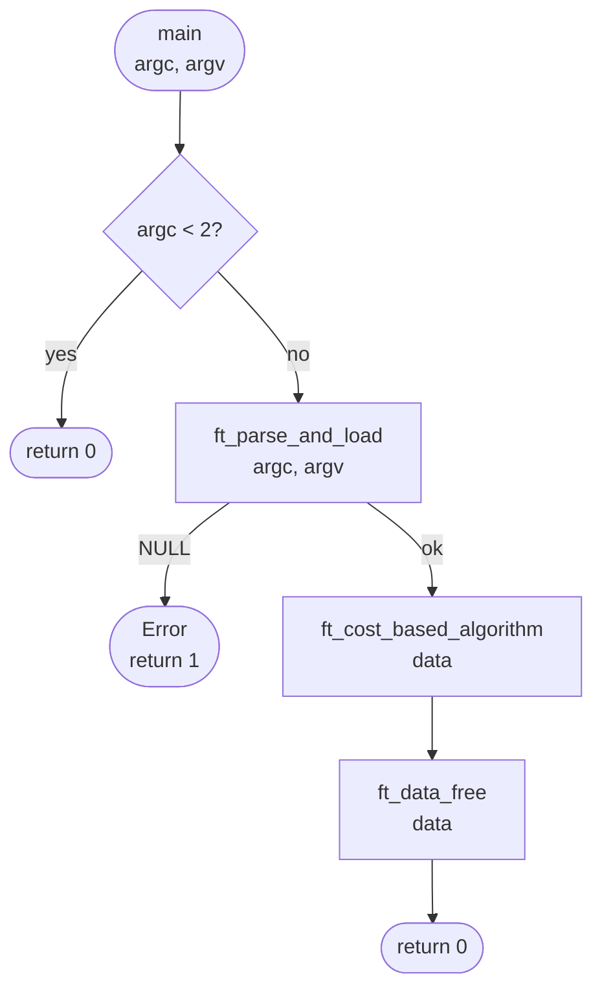
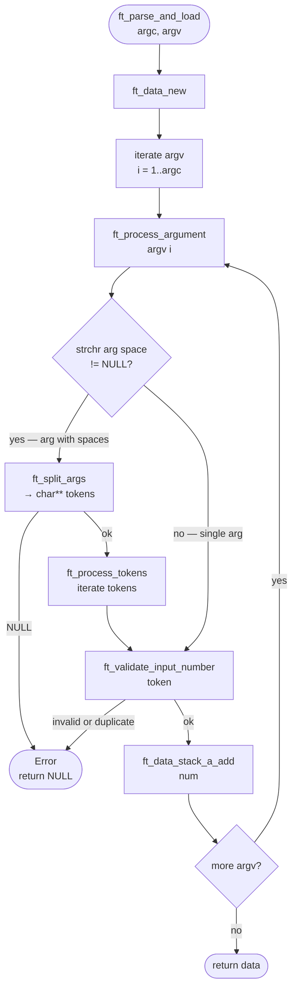
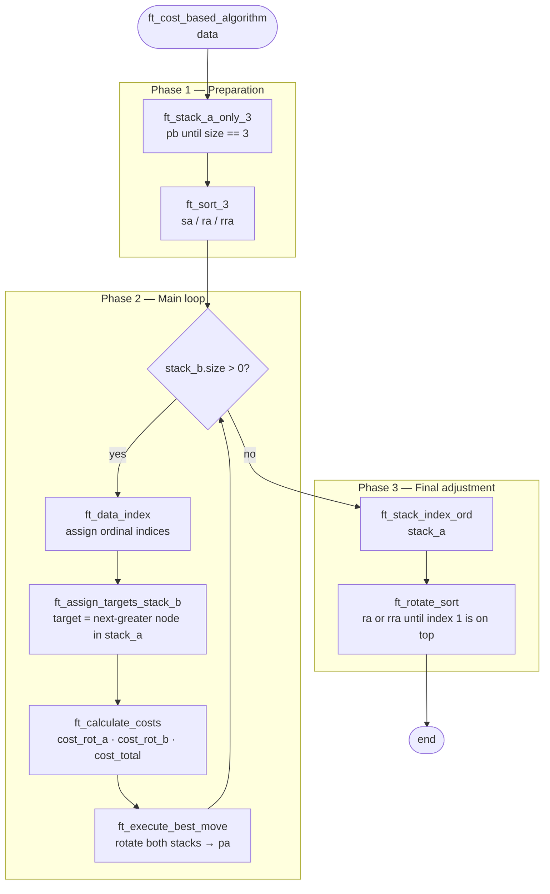
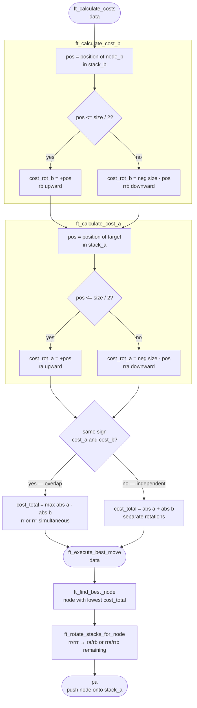

*This project was created as part of the 42 curriculum by rjuarez-*

# 📜 Push_Swap

## 📖 Description

### Goal

Push_Swap is a 42 algorithm project that consists of sorting a stack of integers using a limited set of operations on two stacks (A and B), using the fewest number of moves possible.

### Design decisions

Each part has been encapsulated by splitting every module into its own folder and grouping small, specialised functions into individual files. Descriptive names are used throughout for modules, files and functions to make the codebase easy to navigate, maintain, test and read.

#### Data structures

- Using doubly linked lists allows circular rotations in constant time, which is fundamental for the 11 operations in the project.
- Including the cost-calculation fields directly in each node unifies and simplifies access to the data needed for decision-making.
- Storing the size of each stack in its structure makes cost calculations straightforward and lets us know at a glance how many numbers are left to move.
- Storing a pointer to the target node in A provides immunity to intermediate rotations, direct access without searching, precision by eliminating ambiguities, and consistency since it always points to the same object throughout the process.
- A modular and semantic design makes operations self-explanatory, keeps each stack encapsulated independently from its nodes, and is easy to maintain.
- Optimising the data structure minimises memory usage and CPU cycles required.

##### Data structure

```c
typedef struct s_data
{
	struct t_stack	*A;
	struct t_stack	*B;
	int				n_nodes;
}	t_data;
```

##### Stack structure

```c
typedef struct s_stack
{
	struct t_node	*first_node;
	struct t_node	*end_node;
	int				n_size;
}	t_stack;
```

##### Node structure

```c
typedef struct s_node
{
	// Node data
	int				num;
	int				index;
	// List structure
	struct t_node	*next;
	struct t_node	*previous;
	// Cost calculation fields
	int				cost_rot_a;
	int				cost_rot_b;
	int				cost_total;
	// Target node for insertion
	struct s_node	*target;
}	t_node;
```

#### Moves

All moves are defined in the project subject. After every move, its name is printed to standard output.

##### Push

- **pa**: Takes the top element of stack B and places it on top of stack A. Does nothing if B is empty.
- **pb**: Takes the top element of stack A and places it on top of stack B. Does nothing if A is empty.

##### Swap

- **sa**: Swaps the two topmost elements of stack A. Does nothing if there is only one element or none.
- **sb**: Swaps the two topmost elements of stack B. Does nothing if there is only one element or none.
- **ss**: Executes sa and sb simultaneously.

##### Rotate

- **ra**: Shifts all elements of stack A up by one position. The first element becomes the last.
- **rb**: Shifts all elements of stack B up by one position. The first element becomes the last.
- **rr**: Executes ra and rb simultaneously.

##### Reverse rotate

- **rra**: Shifts all elements of stack A down by one position. The last element becomes the first.
- **rrb**: Shifts all elements of stack B down by one position. The last element becomes the first.
- **rrr**: Executes rra and rrb simultaneously.

#### Loading data into the structure

The parser accepts both space-separated arguments and quoted strings containing multiple numbers:

```bash
# Format 1: separate arguments
./push_swap 5 2 8 1 9

# Format 2: quoted string
./push_swap "5 2 8 1 9"

# Format 3: mixed
./push_swap 5 2 "8 1" 9
```

The 42 subject requires both formats to be supported. To achieve this, the parser:

- Detects whether an argument contains spaces using `ft_strchr()`
- If it does, splits it into tokens using `ft_split_args()`
- If it does not, processes it as a single number

Three-level validation is applied:

1. Format validation with `ft_is_valid_token()`.
2. Range validation using `ft_atol()` to check the result fits within INT range.
3. Duplicate validation with `ft_is_duplicate()`.

On any error, all allocated memory is freed.

#### Sorting algorithm

The algorithm implements a minimum-cost strategy to sort the stack, moving elements between A and B until everything is in order.

##### Stack preparation

1. **Reduce stack A to 3 nodes.**
   - Manageable base case: 3 elements have only 5 possible permutations.
   - Efficiency: it is the largest size that can be sorted in a fixed number of operations.
   - Simplicity: the 3-element algorithm is trivial and fast.
2. **Sort the 3-node stack A.**
   - Normalisation: converts arbitrary numbers into ordinal indices 1..n.
   - Simplified comparison: an index is easier to compare than original values.
   - Target finding: finding the next-greater number becomes finding the next-greater index.

##### Sorting loop

This section iterates until there are no nodes left in B:

1. **Re-index.** Indices change every time a node is moved; recalculating from scratch is simpler than maintaining them incrementally.
2. **Find the target node.** Inserting a number after the next-greater one in A preserves ascending order. If the number is the largest, it wraps around to the front (minimum position).
3. **Calculate costs.**
   - Clear direction: `+` = forward rotation (`ra`/`rb`), `-` = reverse rotation (`rra`/`rrb`).
   - Joint rotation optimisation: same sign = use `rr`/`rrr`, saving up to 50% of operations.
4. **Execute the cheapest move.** Linear O(n) selection, sufficient for the problem size (500–1000 elements). Logical order: joint rotations → individual rotations → `pa`.

##### Final arrangement of stack A

1. **Re-index A**, required after the last node is moved from B.
2. **Rotate until sorted.** The subject requires the smallest element to be on top at the end. The shortest path is always chosen (`ra` or `rra`), guaranteeing the minimum number of rotations.

---

### Implementation

| Module | Files | Main functions | Purpose |
|--------|-------|---------------|---------|
| Data | 6 | `ft_data_new`, `ft_stack_*` | Data structure management |
| Algorithm | 6 | `ft_cost_based_algorithm` | Sorting logic |
| Moves | 6 | `sa`, `sb`, `pa`, `pb`, `ra`, `rb`, `rra`, `rrb` | Push swap operations |
| Parser | 4 | `ft_parse_and_load` | Input validation and loading |
| Libft | 40+ | `ft_abs`, `ft_atol`, `ft_recalloc` | Reusable base functions |
| Ft_Printf | 5 | `ft_printf` | Formatted output |

#### Flowchart — `push_swap.c`



#### 📂 File structure

```
│
├── push_swap.h
├── push_swap.c
├── Makefile
├── README.md
│
└── 📁 src
    ├── 📁 data
    │   ├── data.h
    │   ├── data.c
    │   │   ├── t_data  *ft_data_new(void);
    │   │   ├── int     ft_data_free(t_data *data);
    │   │   ├── void    ft_data_index(t_data *data);
    │   │   ├── int     ft_data_stack_a_add(t_data *data, int nbr);
    │   │   └── int     ft_data_stack_b_add(t_data *data, int nbr);
    │   │
    │   ├── node.c
    │   │   ├── t_node  *ft_node_new(int nbr);
    │   │   └── int     ft_node_free(t_node *node);
    │   │
    │   ├── stack.c
    │   │   ├── t_stack *ft_stack_new(void);
    │   │   ├── int     ft_stack_free(t_stack *stack);
    │   │   ├── void    ft_stack_index_ord(t_stack *stack);
    │   │   ├── int     ft_stack_add(t_stack *stack, t_node *node);
    │   │   └── t_node  *ft_stack_pop(t_stack *stack);
    │   │
    │   └── stack_utils.c
    │       ├── int     ft_stack_add_last(t_stack *stack, t_node *node);
    │       ├── t_node  *ft_stack_pop_last(t_stack *stack);
    │       ├── void    ft_stack_index_clear(t_stack *stack);
    │       └── int     ft_is_sort_stack(t_stack *stack);
    │
    ├── 📁 parser
    │   ├── parser.h
    │   ├── parser.c
    │   │   ├── static int  ft_process_tokens(t_data *data, char **tokens);
    │   │   ├── static int  ft_process_argument(t_data *data, char *arg);
    │   │   └── t_data      *ft_parse_and_load(int argc, char **argv);
    │   │
    │   ├── split_args.c
    │   │   ├── void        ft_free_split(char **tokens);
    │   │   ├── static int  ft_count_tokens(char *str);
    │   │   ├── static char *ft_copy_token(char *str, int *i);
    │   │   └── char        **ft_split_args(char *str);
    │   │
    │   └── validate.c
    │       ├── int ft_is_valid_token(char *str);
    │       ├── int ft_is_duplicate(t_stack *stack, int value);
    │       └── int ft_validate_input_number(t_data *data, char *str, int *num);
    │
    ├── 📁 moves
    │   ├── moves.h
    │   ├── swap.c
    │   │   ├── void    sa(t_data *data);
    │   │   ├── void    sb(t_data *data);
    │   │   ├── void    ss(t_data *data);
    │   │   └── void    ft_swap(t_stack *stack);
    │   │
    │   ├── push.c
    │   │   ├── void    pa(t_data *data);
    │   │   ├── void    pb(t_data *data);
    │   │   └── void    ft_push(t_stack *stack_ori, t_stack *stack_des);
    │   │
    │   ├── rotate.c
    │   │   ├── void    ra(t_data *data);
    │   │   ├── void    rb(t_data *data);
    │   │   ├── void    rr(t_data *data);
    │   │   └── void    ft_rotate(t_stack *stack);
    │   │
    │   ├── reverse_rotate.c
    │   │   ├── void    rra(t_data *data);
    │   │   ├── void    rrb(t_data *data);
    │   │   ├── void    rrr(t_data *data);
    │   │   └── void    ft_reverse_rotate(t_stack *stack);
    │   │
    │   └── moves_utils.c
    │       └── void    ft_register(char *mov);
    │
    ├── 📁 algorithm
    │   ├── algorithm.h
    │   ├── algorithm.c
    │   │   ├── void    ft_rotate_sort(t_data *data);
    │   │   └── void    ft_cost_based_algorithm(t_data *data);
    │   │
    │   ├── first_step.c
    │   │   ├── void    ft_stack_a_only_3(t_data *data);
    │   │   └── void    ft_sort_3(t_data *data);
    │   │
    │   ├── target.c
    │   │   ├── void    ft_find_node_target(t_stack *stack_a, t_node *node_b);
    │   │   └── void    ft_assign_targets_stack_b(t_data *data);
    │   │
    │   ├── cost.c
    │   │   ├── int     ft_get_node_position_in_stack(t_stack *stack, t_node *node);
    │   │   ├── void    ft_calculate_cost_b(t_stack *stack_b, t_node *node_b);
    │   │   ├── void    ft_calculate_cost_a(t_stack *stack_a, t_node *node_b);
    │   │   └── void    ft_calculate_costs(t_data *data);
    │   │
    │   └── execute_best_move.c
    │       ├── t_node  *ft_find_best_node(t_stack *stack_b);
    │       ├── void    ft_rotate_stack_a(t_data *data, int *cost_a);
    │       ├── void    ft_rotate_stack_b(t_data *data, int *cost_b);
    │       ├── void    ft_rotate_stacks_for_node(t_data *data, t_node *best_node);
    │       └── void    ft_execute_best_move(t_data *data);
    │
    ├── 📁 libft
    │   ├── libft.h
    │   ├── ft_abs.c
    │   │   └── int     ft_abs(int num);
    │   ├── ft_atol.c
    │   │   └── long    ft_atol(const char *str);
    │   └── ft_recalloc.c
    │       └── void    *ft_recalloc(unsigned char *old_ptr, unsigned long int new_size);
    │
    └── 📁 ft_printf
        ├── ft_printf.h
        ├── ft_printf.c
        │   ├── int     ft_type_check(char chr, va_list p);
        │   ├── int     ft_printf(const char *format, ...);
        │   └── char    *ft_strtoup(char **text);
        ├── ft_conver_numbers.c
        │   ├── char    ft_conver_digital(unsigned char c);
        │   ├── int     ft_intlen_base(long long int nbr, int base);
        │   ├── unsigned long int ft_uabs(long long int nbr);
        │   └── char    *ft_conver_nbr_base(long long int nbr, int base);
        ├── ft_conver.c
        │   ├── char    *ft_conver_null(char chr);
        │   ├── int     ft_conver_c(int chr);
        │   ├── char    *ft_conver_s(char *str);
        │   └── char    *ft_conver_p(void *ptr);
        └── ft_puts.c
            ├── void    ft_putchr_fd(char c, int fd);
            └── int     ft_puts_fd(char **text, int fd);
```

---

## 📦 Data Module

### 📄 data.c

#### FT_DATA_NEW — `t_data *ft_data_new(void)`

	DEFINITION: Creates and initialises a new t_data structure with empty stacks A and B
	PARAMETERS: None
	RETURN: {t_data*}
		- Success:  Pointer to the newly initialised t_data structure
		- Failure:  NULL if memory allocation fails
	BEHAVIOUR:
		1. Allocates memory for t_data
		2. Creates stack_a with ft_stack_new()
		3. Creates stack_b with ft_stack_new()
		4. Initialises n_nodes to 0

#### FT_DATA_FREE — `int ft_data_free(t_data *data)`

	DEFINITION: Frees all memory associated with the t_data structure and its stacks
	PARAMETERS:
		{t_data*} data - Pointer to the structure to free
	RETURN: {int}
		- Success:  TRUE (1) if freed successfully
		- Failure:  FALSE (0) if data is NULL
	BEHAVIOUR:
		1. Checks that data is not NULL
		2. Frees stack_a with ft_stack_free()
		3. Frees stack_b with ft_stack_free()
		4. Sets n_nodes to 0
		5. Frees data

#### FT_DATA_INDEX — `void ft_data_index(t_data *data)`

	DEFINITION: Assigns ordinal indices to all nodes in stack A and stack B
	PARAMETERS:
		{t_data*} data - Structure containing the stacks
	RETURN: void
	BEHAVIOUR:
		1. Indexes stack A with ft_stack_index_ord()
		2. If stack B exists and is not empty, assigns sequential indices (1, 2, 3...)

#### FT_DATA_STACK_A_ADD — `int ft_data_stack_a_add(t_data *data, int nbr)`

	DEFINITION: Creates a new node with the given number and appends it to the end of stack A
	PARAMETERS:
		{t_data*} data - Structure containing stack A
		{int} nbr      - Number to store in the node
	RETURN: {int}
		- Success:  TRUE (1) if created and added successfully
		- Failure:  FALSE (0) if data is NULL, or stack/node creation fails
	BEHAVIOUR:
		1. Checks that data is not NULL
		2. Creates stack A if it does not exist
		3. Creates a new node with ft_node_new()
		4. Appends the node to the end of the stack with ft_stack_add_last()
		5. Increments n_nodes

#### FT_DATA_STACK_B_ADD — `int ft_data_stack_b_add(t_data *data, int nbr)`

	DEFINITION: Creates a new node with the given number and prepends it to stack B
	PARAMETERS:
		{t_data*} data - Structure containing stack B
		{int} nbr      - Number to store in the node
	RETURN: {int}
		- Success:  TRUE (1) if created and added successfully
		- Failure:  FALSE (0) if data is NULL, or stack/node creation fails
	BEHAVIOUR:
		1. Checks that data is not NULL
		2. Creates stack B if it does not exist
		3. Creates a new node with ft_node_new()
		4. Prepends the node to the stack with ft_stack_add()
		5. Increments n_nodes

---

### 📄 stack.c

#### FT_STACK_NEW — `t_stack *ft_stack_new(void)`

	DEFINITION: Creates and initialises a new empty t_stack structure
	PARAMETERS: None
	RETURN: {t_stack*}
		- Success:  Pointer to the new t_stack structure
		- Failure:  NULL if memory allocation fails
	BEHAVIOUR:
		1. Allocates memory for t_stack
		2. Initialises first_node to NULL
		3. Initialises end_node to NULL
		4. Initialises size to 0

#### FT_STACK_FREE — `int ft_stack_free(t_stack *stack)`

	DEFINITION: Frees the memory of the stack and all its nodes
	PARAMETERS:
		{t_stack*} stack - Pointer to the stack to free
	RETURN: {int}
		- Success:  TRUE (1) if freed successfully
		- Failure:  FALSE (0) if stack is NULL
	BEHAVIOUR:
		1. Pops and removes all nodes from the stack with ft_stack_pop()
		2. Frees each node with ft_node_free()
		3. Frees the stack structure

#### FT_STACK_INDEX_ORD — `void ft_stack_index_ord(t_stack *stack)`

	DEFINITION: Assigns ordinal indices (1..n) to stack nodes based on their numeric values
	PARAMETERS:
		{t_stack*} stack - Stack to index
	RETURN: void
	BEHAVIOUR:
		1. Clears existing indices with ft_stack_index_clear()
		2. Iterates from i=1 to stack size
		3. On each iteration, finds the unindexed node with the minimum value
		4. Assigns index i to that node
	EXAMPLE: [42, 7, 99, 23, 5] → indices [4, 2, 5, 3, 1]

#### FT_STACK_ADD — `int ft_stack_add(t_stack *stack, t_node *node)`

	DEFINITION: Prepends a node to the stack
	PARAMETERS:
		{t_stack*} stack - Stack to add to
		{t_node*}  node  - Node to add
	RETURN: {int}
		- Success:  TRUE (1) if added successfully
		- Failure:  FALSE (0) if stack or node is NULL
	BEHAVIOUR:
		1. Validates parameters
		2. If the stack is empty, the node becomes both first and end
		3. Otherwise, the new node points to the current first_node
		4. Updates first_node to the new node
		5. Increments size

#### FT_STACK_POP — `t_node *ft_stack_pop(t_stack *stack)`

	DEFINITION: Removes and returns the first node of the stack
	PARAMETERS:
		{t_stack*} stack - Stack to pop from
	RETURN: {t_node*}
		- Success:  Pointer to the popped node
		- Failure:  NULL if stack is NULL or empty
	BEHAVIOUR:
		1. Checks the stack is not empty
		2. Saves a reference to first_node
		3. Updates first_node to the next node
		4. If the stack becomes empty, end_node is also set to NULL
		5. Decrements size
		6. Disconnects the popped node (next and previous set to NULL)

---

### 📄 stack_utils.c

#### FT_STACK_ADD_LAST — `int ft_stack_add_last(t_stack *stack, t_node *node)`

	DEFINITION: Appends a node to the end of the stack
	PARAMETERS:
		{t_stack*} stack - Stack to add to
		{t_node*}  node  - Node to add
	RETURN: {int}
		- Success:  TRUE (1) if added successfully
		- Failure:  FALSE (0) if stack or node is NULL
	BEHAVIOUR:
		1. Validates parameters
		2. If the stack is empty, the node becomes both first and end
		3. Otherwise, the current end_node points to the new node
		4. Updates end_node to the new node
		5. Increments size

#### FT_STACK_POP_LAST — `t_node *ft_stack_pop_last(t_stack *stack)`

	DEFINITION: Removes and returns the last node of the stack
	PARAMETERS:
		{t_stack*} stack - Stack to pop from
	RETURN: {t_node*}
		- Success:  Pointer to the popped node
		- Failure:  NULL if stack is NULL or empty
	BEHAVIOUR:
		1. Checks the stack is not empty
		2. Saves a reference to end_node
		3. Updates end_node to the previous node
		4. If the stack becomes empty, first_node is also set to NULL
		5. Decrements size
		6. Disconnects the popped node

#### FT_STACK_INDEX_CLEAR — `void ft_stack_index_clear(t_stack *stack)`

	DEFINITION: Sets the index of every node in the stack to 0
	PARAMETERS:
		{t_stack*} stack - Stack whose indices to clear
	RETURN: void
	BEHAVIOUR:
		1. Iterates over all nodes in the stack
		2. Sets index = 0 on each one

#### FT_IS_SORT_STACK — `int ft_is_sort_stack(t_stack *stack)`

	DEFINITION: Checks whether the stack is circularly sorted by index
	PARAMETERS:
		{t_stack*} stack - Stack to verify
	RETURN: {int}
		- Success:  TRUE (1) if circularly sorted
		- Failure:  FALSE (0) if not sorted
	BEHAVIOUR:
		1. Finds the node with index 1
		2. Verifies that indices follow ascending circular order from that point

---

### 📄 node.c

#### FT_NODE_NEW — `t_node *ft_node_new(int nbr)`

	DEFINITION: Creates and initialises a new node with the given number
	PARAMETERS:
		{int} nbr - Number to store in the node
	RETURN: {t_node*}
		- Success:  Pointer to the newly initialised node
		- Failure:  NULL if memory allocation fails
	BEHAVIOUR:
		1. Allocates memory for t_node
		2. Initialises num with nbr
		3. Initialises next and previous to NULL
		4. Initialises index to 0
		5. Initialises target to NULL
		6. Initialises cost_rot_a, cost_rot_b and cost_total to 0

#### FT_NODE_FREE — `int ft_node_free(t_node *node)`

	DEFINITION: Frees the memory of a node
	PARAMETERS:
		{t_node*} node - Node to free
	RETURN: {int}
		- Success:  TRUE (1) if freed successfully
		- Failure:  FALSE (0) if node is NULL
	BEHAVIOUR:
		1. Checks that node is not NULL
		2. Frees the node's memory

---

## 📦 Parser Module

### 🔄 Flowchart



### 📄 parser.c

#### FT_PARSE_AND_LOAD — `t_data *ft_parse_and_load(int argc, char **argv)`

	DEFINITION: Processes command-line arguments and loads the numbers into data
	PARAMETERS:
		{int}    argc - Argument count
		{char**} argv - Argument array
	RETURN: {t_data*}
		- Success:  Pointer to t_data with the numbers loaded
		- Failure:  NULL on error or memory failure
	BEHAVIOUR:
		1. Creates a new t_data structure
		2. Iterates over arguments (starting from argv[1])
		3. Calls ft_process_argument() for each argument
		4. On error, frees everything and returns NULL

#### FT_PROCESS_ARGUMENT — `static int ft_process_argument(t_data *data, char *arg)`

	DEFINITION: Processes a single argument (which may contain multiple numbers)
	PARAMETERS:
		{t_data*} data - Structure to load data into
		{char*}   arg  - Argument to process
	RETURN: {int}
		- Success:  FALSE (0) if processed successfully
		- Failure:  TRUE (1) on error
	BEHAVIOUR:
		1. If the argument contains spaces, splits it into tokens with ft_split_args()
		2. Processes each token with ft_process_tokens()
		3. If it contains no spaces, validates it as a single number

#### FT_PROCESS_TOKENS — `static int ft_process_tokens(t_data *data, char **tokens)`

	DEFINITION: Processes an array of tokens (numbers as strings)
	PARAMETERS:
		{t_data*} data   - Structure to load data into
		{char**}  tokens - Array of number strings
	RETURN: {int}
		- Success:  FALSE (0) if processed successfully
		- Failure:  TRUE (1) on error
	BEHAVIOUR:
		1. Iterates over each token
		2. Validates and converts each token to an integer
		3. Adds the number to stack A

---

### 📄 split_args.c

#### FT_SPLIT_ARGS — `char **ft_split_args(char *str)`

	DEFINITION: Splits a string of space-separated numbers into an array of tokens
	PARAMETERS:
		{char*} str - String to split
	RETURN: {char**}
		- Success:  NULL-terminated array of tokens
		- Failure:  NULL if memory allocation fails
	BEHAVIOUR:
		1. Counts the number of tokens in the string
		2. Allocates memory for the token array
		3. Copies each token individually
		4. Terminates the array with NULL

#### FT_COUNT_TOKENS — `static int ft_count_tokens(char *str)`

	DEFINITION: Counts how many tokens are in a string
	PARAMETERS:
		{char*} str - String to analyse
	RETURN: {int} - Number of tokens found
	BEHAVIOUR:
		1. Iterates over the string
		2. Skips spaces
		3. Each sequence of non-space characters counts as one token

#### FT_COPY_TOKEN — `static char *ft_copy_token(char *str, int *i)`

	DEFINITION: Copies one token starting from the current position in the string
	PARAMETERS:
		{char*} str - Source string
		{int*}  i   - Pointer to current position (updated on return)
	RETURN: {char*}
		- Success:  String containing the copied token
		- Failure:  NULL if memory allocation fails
	BEHAVIOUR:
		1. Advances to the start of the token
		2. Calculates the token length
		3. Copies the token into newly allocated memory

#### FT_FREE_SPLIT — `void ft_free_split(char **tokens)`

	DEFINITION: Frees the memory of a token array created by ft_split_args
	PARAMETERS:
		{char**} tokens - Token array to free
	RETURN: void
	BEHAVIOUR:
		1. Iterates over the array freeing each token
		2. Frees the array itself

---

### 📄 validate.c

#### FT_IS_VALID_TOKEN — `int ft_is_valid_token(char *str)`

	DEFINITION: Checks whether a token is a valid number
	PARAMETERS:
		{char*} str - Token to validate
	RETURN: {int}
		- Success:  TRUE (1) if the token is valid
		- Failure:  FALSE (0) if invalid
	VALIDATIONS:
		- Cannot be empty
		- May have an optional sign (+ or -) at the start
		- Only digits after the sign
		- No non-numeric characters allowed
	VALID EXAMPLES:   "42", "+42", "-5"
	INVALID EXAMPLES: "", "+", "-", "42a", "  5"

#### FT_IS_DUPLICATE — `int ft_is_duplicate(t_stack *stack, int value)`

	DEFINITION: Checks whether a value already exists in the stack
	PARAMETERS:
		{t_stack*} stack - Stack to search
		{int}      value - Value to look for
	RETURN: {int}
		- Success:  TRUE (1) if the value is a duplicate
		- Failure:  FALSE (0) if not found
	BEHAVIOUR:
		1. Iterates over all nodes in the stack
		2. Compares node->num with value
		3. Returns TRUE if a match is found

#### FT_VALIDATE_INPUT_NUMBER — `int ft_validate_input_number(t_data *data, char *str, int *num)`

	DEFINITION: Validates a number string and stores it if correct
	PARAMETERS:
		{t_data*} data - Structure containing stack A for duplicate checking
		{char*}   str  - Number string to validate
		{int*}    num  - Pointer where the validated number is stored
	RETURN: {int}
		- Success:  FALSE (0) if validation passes
		- Failure:  TRUE (1) on error
	VALIDATIONS:
		1. Valid format (ft_is_valid_token)
		2. Value within INT_MIN and INT_MAX (using ft_atol)
		3. No duplicate in stack A

---

## 📦 Moves Module

### 📄 push.c

#### FT_PUSH — `void ft_push(t_stack *stack_ori, t_stack *stack_des)`

	DEFINITION: Pops a node from the source stack and pushes it onto the destination
	PARAMETERS:
		{t_stack*} stack_ori - Source stack (to pop from)
		{t_stack*} stack_des - Destination stack (to push onto)
	RETURN: void
	BEHAVIOUR:
		1. Pops the first node from stack_ori with ft_stack_pop()
		2. If the node exists, prepends it to stack_des with ft_stack_add()

#### PA — `void pa(t_data *data)`

	DEFINITION: Moves the top element of stack B to stack A
	BEHAVIOUR:
		1. Checks that stack B is not empty
		2. Executes ft_push() from B to A
		3. Registers the move "pa"

#### PB — `void pb(t_data *data)`

	DEFINITION: Moves the top element of stack A to stack B
	BEHAVIOUR:
		1. Checks that stack A is not empty
		2. Executes ft_push() from A to B
		3. Registers the move "pb"

---

### 📄 swap.c

#### FT_SWAP — `void ft_swap(t_stack *stack)`

	DEFINITION: Swaps the two topmost elements of the stack
	BEHAVIOUR:
		1. Checks that the stack has at least 2 elements
		2. Pops the two top nodes with ft_stack_pop()
		3. Pushes them back in reverse order

#### SA — `void sa(t_data *data)`
	Swaps the two top elements of stack A. Registers "sa".

#### SB — `void sb(t_data *data)`
	Swaps the two top elements of stack B. Registers "sb".

#### SS — `void ss(t_data *data)`
	Executes sa and sb simultaneously. Registers "ss".

---

### 📄 rotate.c

#### FT_ROTATE — `void ft_rotate(t_stack *stack)`

	DEFINITION: Rotates the stack upward (the first element goes to the end)
	BEHAVIOUR:
		1. Pops the first node with ft_stack_pop()
		2. Appends it to the end with ft_stack_add_last()

#### RA — `void ra(t_data *data)`
	Rotates stack A upward. Registers "ra".

#### RB — `void rb(t_data *data)`
	Rotates stack B upward. Registers "rb".

#### RR — `void rr(t_data *data)`
	Executes ra and rb simultaneously. Registers "rr".

---

### 📄 reverse_rotate.c

#### FT_REVERSE_ROTATE — `void ft_reverse_rotate(t_stack *stack)`

	DEFINITION: Rotates the stack downward (the last element goes to the top)
	BEHAVIOUR:
		1. Pops the last node with ft_stack_pop_last()
		2. Prepends it with ft_stack_add()

#### RRA — `void rra(t_data *data)`
	Rotates stack A downward. Registers "rra".

#### RRB — `void rrb(t_data *data)`
	Rotates stack B downward. Registers "rrb".

#### RRR — `void rrr(t_data *data)`
	Executes rra and rrb simultaneously. Registers "rrr".

---

### 📄 moves_utils.c

#### FT_REGISTER — `void ft_register(char *mov)`

	DEFINITION: Registers (prints) a move that was performed
	PARAMETERS:
		{char*} mov - String containing the move name
	RETURN: void
	BEHAVIOUR:
		1. Prints the move using ft_printf()
		2. Appends a newline character

---

## 📦 Algorithm Module

### 🔄 Flowchart — main algorithm



### 🔄 Flowchart — cost calculation and execution



---

### 📄 algorithm.c

#### FT_COST_BASED_ALGORITHM — `void ft_cost_based_algorithm(t_data *data)`

	DEFINITION: Main sorting algorithm based on cost calculation
	PARAMETERS:
		{t_data*} data - Structure containing the stacks
	RETURN: void
	BEHAVIOUR:
		1. Reduces stack A to 3 elements
		2. Sorts those 3 elements
		3. While stack B is not empty:
		   - Re-indexes both stacks
		   - Assigns targets to all nodes in B
		   - Calculates the cost of moving each node
		   - Executes the cheapest move
		4. Final sort: rotates until index 1 is on top

#### FT_ROTATE_SORT — `void ft_rotate_sort(t_data *data)`

	DEFINITION: Rotates stack A until the node with index 1 is on top
	PARAMETERS:
		{t_data*} data - Structure containing stack A
	RETURN: void
	BEHAVIOUR:
		1. Finds the position of the node with index 1
		2. If it is in the upper half, uses rra
		3. If it is in the lower half, uses ra
		4. Rotates until index 1 is first_node

---

### 📄 first_step.c

#### FT_STACK_A_ONLY_3 — `void ft_stack_a_only_3(t_data *data)`

	DEFINITION: Reduces stack A to exactly 3 elements by moving the rest to B
	PARAMETERS:
		{t_data*} data - Structure containing the stacks
	RETURN: void
	BEHAVIOUR:
		1. While stack A has more than 3 elements, executes pb
		2. If exactly 3 remain, calls ft_sort_3()
		3. Indexes the resulting stack A

#### FT_SORT_3 — `void ft_sort_3(t_data *data)`

	DEFINITION: Sorts a stack of exactly 3 elements
	PARAMETERS:
		{t_data*} data - Structure containing stack A
	RETURN: void
	BEHAVIOUR: Handles all 5 possible permutations:

	| Permutation | Operations |
	|-------------|------------|
	| 2, 1, 3     | sa         |
	| 3, 2, 1     | sa + rra   |
	| 3, 1, 2     | ra         |
	| 2, 3, 1     | sa + ra    |
	| 1, 3, 2     | rra        |

---

### 📄 target.c

#### FT_FIND_NODE_TARGET — `void ft_find_node_target(t_stack *stack_a, t_node *node_b)`

	DEFINITION: Finds the target node in stack A for a given node from stack B
	PARAMETERS:
		{t_stack*} stack_a - Stack A to search
		{t_node*}  node_b  - Stack B node that needs a target
	RETURN: void (sets node_b->target)
	BEHAVIOUR:
		1. Searches for the node in A with the next-greater value than node_b->num
		2. If none exists (node_b is the largest), takes the node with the minimum value
		3. Assigns that node as node_b->target
	EXAMPLE:
		Stack A: [1, 3, 5, 7, 9]
		node_b->num = 6  → target = 7
		node_b->num = 10 → target = 1 (wrap around)

#### FT_ASSIGN_TARGETS_STACK_B — `void ft_assign_targets_stack_b(t_data *data)`

	DEFINITION: Assigns targets to all nodes in stack B
	PARAMETERS:
		{t_data*} data - Structure containing the stacks
	RETURN: void
	BEHAVIOUR:
		1. Iterates over all nodes in stack B
		2. Calls ft_find_node_target() for each one

---

### 📄 cost.c

#### FT_GET_NODE_POSITION_IN_STACK — `int ft_get_node_position_in_stack(t_stack *stack, t_node *node_search)`

	DEFINITION: Returns the position (index) of a node within the stack
	PARAMETERS:
		{t_stack*} stack       - Stack to search
		{t_node*}  node_search - Node to locate
	RETURN: {int}
		- Success:  Position of the node (0 = first_node)
		- Failure:  -1 if the node is not found

#### FT_CALCULATE_COST_B — `void ft_calculate_cost_b(t_stack *stack_b, t_node *node_b)`

	DEFINITION: Calculates the rotation cost to bring a node in B to the top
	PARAMETERS:
		{t_stack*} stack_b - Stack B containing the node
		{t_node*}  node_b  - Node to evaluate
	RETURN: void (sets node_b->cost_rot_b)
	BEHAVIOUR:
		1. Gets the position of the node in stack B
		2. If position <= size/2: cost = +position (use rb)
		3. If position > size/2:  cost = -(size - position) (use rrb)
	EXAMPLE:
		Stack B size 5, node at position 4:
		4 > 2.5 → cost_rot_b = -(5-4) = -1  (1 rrb)

#### FT_CALCULATE_COST_A — `void ft_calculate_cost_a(t_stack *stack_a, t_node *node_b)`

	DEFINITION: Calculates the rotation cost to bring the target in A to the top
	PARAMETERS:
		{t_stack*} stack_a - Stack A containing the target
		{t_node*}  node_b  - B node whose target is being evaluated
	RETURN: void (sets node_b->cost_rot_a)
	BEHAVIOUR:
		1. Gets the position of the target in stack A
		2. If position <= size/2: cost = +position (use ra)
		3. If position > size/2:  cost = -(size - position) (use rra)

#### FT_CALCULATE_COSTS — `void ft_calculate_costs(t_data *data)`

	DEFINITION: Calculates the total cost of moving each node from B to A
	PARAMETERS:
		{t_data*} data - Structure containing the stacks
	RETURN: void
	BEHAVIOUR:
		1. For each node in B, calculates cost_rot_a and cost_rot_b
		2. Computes total cost using the formula:
		   - Same direction: max(|cost_a|, |cost_b|)
		   - Opposite directions: |cost_a| + |cost_b|

---

### 📄 execute_best_move.c

#### FT_FIND_BEST_NODE — `t_node *ft_find_best_node(t_stack *stack_b)`

	DEFINITION: Finds the node in B with the lowest total cost
	PARAMETERS:
		{t_stack*} stack_b - Stack B to search
	RETURN: {t_node*} - Pointer to the node with the lowest cost_total
	BEHAVIOUR:
		1. Iterates over all nodes in B
		2. Compares each node's cost_total
		3. Returns the one with the lowest value

#### FT_ROTATE_STACK_A — `void ft_rotate_stack_a(t_data *data, int *cost_a)`

	DEFINITION: Executes the required rotations on stack A according to the cost
	BEHAVIOUR:
		1. While cost_a > 0: executes ra() and decrements cost_a
		2. While cost_a < 0: executes rra() and increments cost_a

#### FT_ROTATE_STACK_B — `void ft_rotate_stack_b(t_data *data, int *cost_b)`

	DEFINITION: Executes the required rotations on stack B according to the cost
	BEHAVIOUR:
		1. While cost_b > 0: executes rb() and decrements cost_b
		2. While cost_b < 0: executes rrb() and increments cost_b

#### FT_ROTATE_STACKS_FOR_NODE — `void ft_rotate_stacks_for_node(t_data *data, t_node *best_node)`

	DEFINITION: Executes joint rotations and then individual ones for a node
	PARAMETERS:
		{t_data*} data      - Structure containing the stacks
		{t_node*} best_node - Optimal node to move
	RETURN: void
	BEHAVIOUR:
		1. While both costs are positive: executes rr()
		2. While both costs are negative: executes rrr()
		3. Executes any remaining individual rotations on A and B

#### FT_EXECUTE_BEST_MOVE — `void ft_execute_best_move(t_data *data)`

	DEFINITION: Finds and executes the cheapest move
	PARAMETERS:
		{t_data*} data - Structure containing the stacks
	RETURN: void
	BEHAVIOUR:
		1. Finds the best node with ft_find_best_node()
		2. Rotates both stacks to bring the node and its target to the top
		3. Executes pa() to move the node from B to A

---

## 📦 Libft Module

Only the functions that are new relative to the original libft project are included.

### 📄 ft_abs.c

#### FT_ABS — `int ft_abs(int num)`

	DEFINITION: Returns the absolute value of an integer
	PARAMETERS:
		{int} num - Number to convert
	RETURN: {int} - Absolute value of the number
	BEHAVIOUR:
		- If num >= 0, returns num
		- If num < 0,  returns -num

### 📄 ft_atol.c

#### FT_ATOL — `long ft_atol(const char *str)`

	DEFINITION: Converts a string to a long integer
	PARAMETERS:
		{const char*} str - String to convert
	RETURN: {long} - Converted value
	BEHAVIOUR:
		1. Skips leading whitespace
		2. Processes optional sign (+ or -)
		3. Converts digits to number
		4. Returns the result as a long

### 📄 ft_recalloc.c

#### FT_RECALLOC — `void *ft_recalloc(unsigned char *old_ptr, unsigned long int new_size)`

	DEFINITION: Performs a realloc with zero-initialisation of the new memory
	PARAMETERS:
		{unsigned char*}    old_ptr  - Old pointer to resize
		{unsigned long int} new_size - New size in bytes
	RETURN: {void*}
		- Success:  Pointer to the new memory
		- Failure:  NULL if allocation fails
	BEHAVIOUR:
		1. Allocates new zero-initialised memory with ft_calloc()
		2. Copies the old contents into the new memory
		3. Frees the old memory
		4. Returns the new pointer

---

## 📦 Ft_printf Module

This is the same as the original ft_printf project and is not broken down further here.

---

## ⚙️ Instructions

### Compilation

If we want to compile without the Makefile, we will use the following command:

```bash
cc -Wall -Wextra -Werror \
push_swap.c \
src/data/data.c \
src/data/node.c \
src/data/stack.c \
src/data/stack_utils.c \
src/parser/parser.c \
src/parser/split_args.c \
src/parser/validate.c \
src/moves/swap.c \
src/moves/push.c \
src/moves/rotate.c \
src/moves/reverse_rotate.c \
src/moves/moves_utils.c \
src/algorithm/algorithm.c \
src/algorithm/first_step.c \
src/algorithm/target.c \
src/algorithm/cost.c \
src/algorithm/execute_best_move.c \
src/libft/*.c \
src/ft_printf/*.c \
-o push_swap
```

The project includes a Makefile, so compilation only requires running `make`. All compiler flags and settings are defined in the Makefile itself.

```bash
make
```

This will produce the `push_swap` executable.

| Rule | Description |
|------|-------------|
| `make` / `make all` | Compiles the program |
| `make clean` | Removes object files (.o) |
| `make fclean` | Removes object files and the executable |
| `make re` | Full recompilation from scratch |

### Usage

```bash
./push_swap 5 2 8 1 9
./push_swap "5 2 8 1 9"
./push_swap 5 2 "8 1" 9
```

---

## 📚 Resources

### Classic references

- Research into different sorting methods.
- Reference books on C, data structures and algorithms.
- Review of other students' projects.

### Use of AI

- Evaluation of different data structures.
- Evaluation of different sorting algorithms with step-by-step explanations to understand how they work.
- Generation of flowcharts for the README.
- Automation of function descriptions for each file.
- Translate the readme file.
